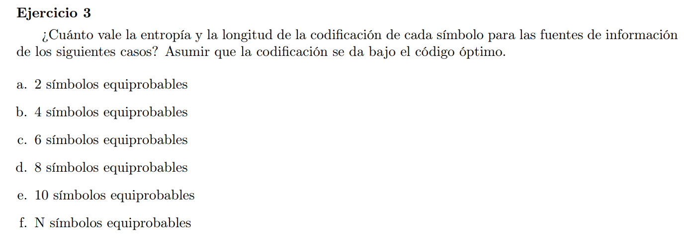

### f

Como tenemos N simbolos equiprobables $ p(s_i) = \frac{1}{N}$ y $I(s_i) = - \log(\frac{1}{N}) = log(N)$

$$\begin{align*}    
H(S) = & \  \sum_{s \in S}{ p(s) I(s) } = \sum_{s \in S}{\frac{1}{N} log(N)} = \\
= & \ \frac{1}{N} log(N) \sum_{s \in S} 1 = log(N)
\end{align*}$$

Si el código es óptimo entonces $L(C)$ es mínimo. Es decir $L(C) = H(S) = log(N)$

### b

$H(S) = L(C)= log_2(4) = 2$