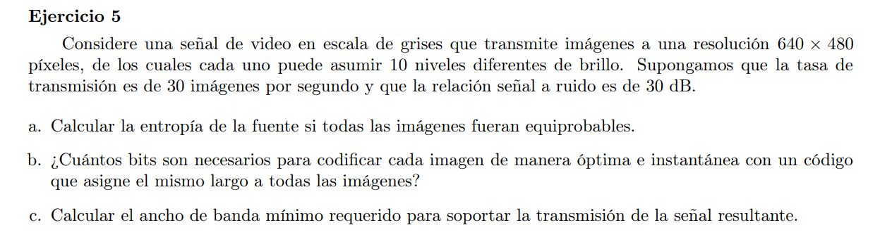
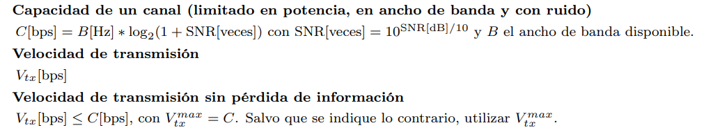

### a

Cantidad de imagenes diferentes: $10^{640 \times 480}$

Fuente emite imagenes a 30 imagenes por segundo y las imagenes son equiprobable.

$H(S) = log_2(10^{640 \times 480}) = 640 \times 480 \times 3,32 \approx 1.020.496,31 $ bits

### b

La entropía da la cantidad de información esperada de una fuente. Por lo que de cierto modo acota la cantidad de bits para la codificación de los mensajes de dicha fuente tal que no se pierda información: $H(S) \leq L(C)$

Luego la cantidad de bits necesarias para codificar cada imagen de forma óptima e instantanea con un código que asigne el mismo largo a cada imagen es $ \lceil H(S) \rceil $. En este caso sería 1.020.497.

### c

Vamos a asumir entonces que la velocidad de transmición impone la capacidad del canal.

$C = V_{tx} = 30 \frac{img}{seg} = 30.614.910 \frac{bits}{seg}$

$SNR = 10^{\frac{30}{10}} = 1000$

$B = \frac{ C }{ log_2(1+ SNR) }= \frac{30.614.910}{log_2(1001)} \approx 3.071.557,64$