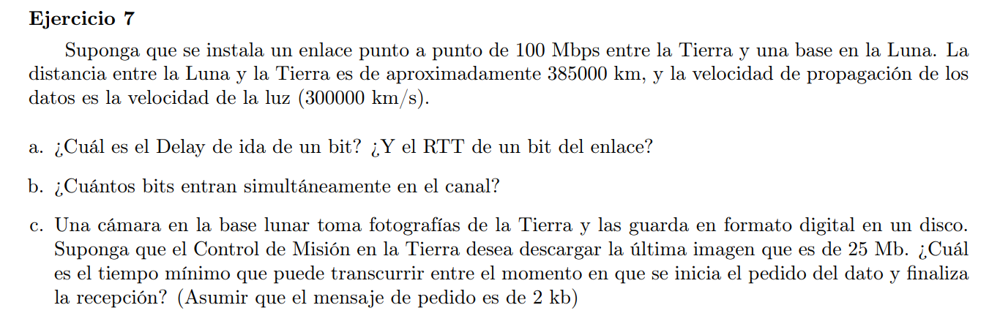

### a

$Delay(1) \approx T_{prop} = \frac{distancia}{V_{prop}} = \frac{385000}{300000} = 1,28 seg $

$RTT(1) = 2 * Delay = 2,56 seg$

### b

$C_{vol} = Delay * V_{tx} = 1,28 seg * 100 Mbps = 128,3Mb$

### c

$T_{pedido} = T_{tx}(2kb) + T_{prop} = \frac{2kb}{100Mbps} +1,28seg = 0,00005 +1,28 \approx 1.28 seg$

$ T_{respuesta} = T_{tx}(25Mb) + T_{prop} = \frac{25Mb}{100Mbps} +1,28seg = 0,25 +1,28 = 1,53 seg$

$T = T_{pedido} + T_{respuesta} = 1.28 + 1,53 = 2.81seg$