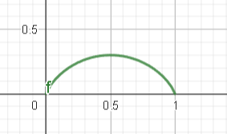

### a

$ I(s_1) = -\log(p_1) = -\log(1 - p_0)$

$$ 
\begin{align*}
H(S) = \sum_{s \in S}{ p(s) I(s) } = & \ - p_0 log(p_0) + p(s_1) I(s_1) \\
                                        & - p_0 log(p_0) + (1-p_0) I(s_1) \\
                                        & - p_0 log(p_0) - (1-p_0)\log(1 - p_0) \\
\end{align*}
$$

$$
H(S) = f(p_0) = - (p_0 log(p_0) + (1-p_0)\log(1 - p_0))
$$

### b

### c

La entropía es máxima cuando $p_0 = 0.5 \iff p_1 = 1 - 0.5 = 0.5$, es decir cuando tenemos el mayor grado de incerteza al ser ambos igual de probables.

A medida que incrementamos o decrementamos $p_0$ desde el valor 0.5, estamos decrementando la incerteza, ya que un evento es más probable que ocurra.