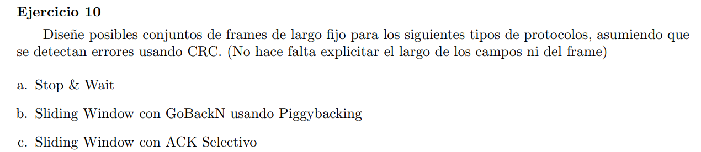

CRC: se agregan bits de checksum para control de errores

### a

En este esquema el emisor, por cada frame enviado, espera el ACK del receptor para enviar el siguiente frame. Si pasa mucho tiempo (timeout) sin recibir respuesta reenvia el frame.

Para este esquema necesitamos identificar al menos 2 frames para evitar el problema de reencarnación: se envia el frame 0, el receptor envia el ack0 pero no le llega al emisor. El emisor timeoutea y reenvia frame 0, el receptor lo descarta y manda nuevamente ack0. Si no identificaramos los frames enviados, el receptor podría interpretar erroneamente este nuevo frame como el siguiente a procesar

> #seq(1bit);#dato;CRC

Y para el receptor

> #ACK(1bit);CRC

### b

Como se usa GoBackN, entonces el reciever no tiene buffers para ir guardando paquetes que le lleguen. Por lo que en el momento que le falta uno, se tienen que retrasmitir todos los paquetes a partir de ese.

[Piggybacking](https://en.wikipedia.org/wiki/Piggybacking_(data_transmission)): Tanto el emisor como el receptor pueden enviar paquetes de datos. Para aprovechar esto, dichos paquetes se envian con los mensajes de ACK. Esto trae la desventaja de que el receptor puede bloquearse (para mandar un ACK hay que esperar a que se forme el siguiente paquete a mandar). Se soluciona con un timer, pasado el mismo se manda un frame solo con ACK.

Ventaja: se usa mejor el canal de transmisión (bandwidth).

Three rules govern the piggybacking data transfer.

> * If station A wants to send both data and an acknowledgment, it keeps both fields there.
> * If station A wants to send the acknowledgment, after a short period of time to see whether a data frame needs to be sent, then decide whether send an ACK frame alone or attach a data frame with it.
> * If station A wants to send just the data, then the previous acknowledgment field is sent along with the data. Station B simply ignores this duplicate ACK frame upon receiving.

Por lo tanto hay una única estructura de frame que usa tanto el emisor como el receptor

> #ACK;#SEQ;DATA;CRC

donde la cantidad de bits de ACK y SEQ dependen del tamaño del sliding window

### c

SACK es un protocolo que agrega información en los paquetes que envia el receptor para poder informarle al emisor sobre paquetes perdidos al emisor y éste solo tenga que reenviar dichos paquetes. (Sin este esquema, el protocolo sería en orden, entonces si no llega el paquete esperado los siguientes recibidos que no sean el esperado se descartan).

Emisor

> #seq;data;crc

Receptor

> #ack;sack;crc

[Sack ejemplo](https://www.geeksforgeeks.org/selective-acknowledgments-sack-in-tcp/#:~:text=Working%20of%20SACK-,Explanation,-%3A)