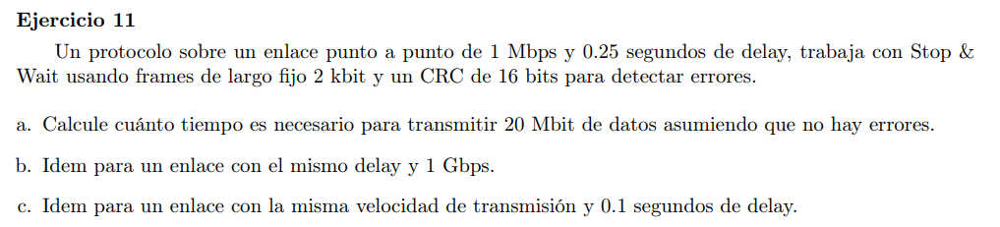

### a

Se usan frames fijos de 2kb en los que 16 bits son de CRC y como el protocolo es de stop and wait, necesito 1 bit para diferenciar frames y evitar rencarnación. Luego la cantidad de bits de datos del frame:

> 2000-16-1 = 1983

Se necesitan enviar 20Mbit de datos, por lo que se necesitan 

> 20000000/1983 = 10086 frames

Como estamos en el esquema de stop & wait, por cada frame que enviamos debemos esperar al ack para enviar el siguiente. Luego el tiempo que se tarda en enviar un frame es $RTT= 2 * delay = 0.5$ (el tiempo de transmición de un frame es despreciable: $2kb/1Mb = 0.002s$). Luego necesitamos mandar 10086 frames, por lo que el tiempo necesario es de $10086 * 0.5s = 5043s$

### b

En este caso el tiempo de tx se hace más despreciable, pero tenemos el mismo tiempo de transferencia.

### c

Ahora el tiempo necesario es de $0.1 * 2 * 10086 = 2.017,2s$