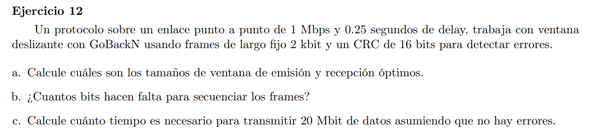
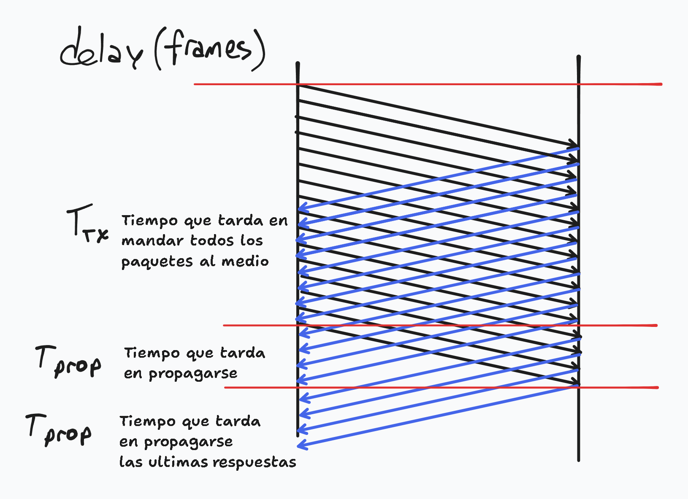

### a

El tamaño de ventana óptimo se calcula teniendo en cuenta la capacidad del canal. Queremos transmitir la mayor cantidad de frames tal que se use en su totalidad la capacidad del canal.

Si el canal soporta una velocidad de transmisión $V$, el tamaño del frame es $f$ y hay un RTT $r$, entonces la cantidad de frames óptima es $\frac{V \cdot r}{f}$

$V \cdot r$ nos da cuantos bits podriamos transmitir con velocidad $V$ es un tiempo $r$. Luego al dividirlo por $f$ tenemos la cantidad en frames.

Entonces si tenemos un SWS (Sender Windows Size) que soporte completamente la capacidad de canal, entonces estamos usando de manera óptima el mismo.

$SWS = \frac{1Mbps \cdot 2 \cdot 0.25s}{2kb}= 250$ frames

Como estamos en el protocolo de GoBackN, $RWS = 1$ frame

### b

8 bits: $2^8=256$

### c

Si asumimos que no hay errores entonces todos los frames llegan en el tiempo esperado (dado por el delay) y que no hay que retrasmitir ningun frame.

Es un frame fijo de 2kb, de los cuales 8 usamos para el numero de secuencia y 16 para el CRC. Luego por cada frame tenemos $2000-8-16 = 1976$ bits de datos.

Queremos transmitir 20Mbit de datos, por lo que necesitamos transmitir $20Mbit / 1976 bit = 10122$ frames.

Luego el tiempo necesario para la transmisión es 

$$
\begin{align*}
Delay(10122 \text{ frames}) &= T_{tx}(10122 \text{ frames}) + T_{prop} \\
&= \frac{|frame|}{V_{tx}} \cdot 10122 + 0.25  \\
&=  \frac{2000}{1000000} \cdot 10122 + 0.25 =  20.494s\\
\end{align*}$$

Luego a este resultado hay que agregar el tiempo de propagación de los últimos ACK.

Queda que el tiempo total es $20.494 + 0.25 = 20.744s$

{width=50%}