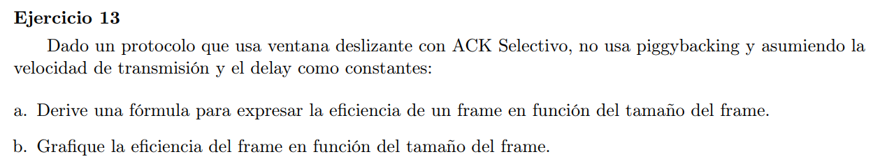

### a

Sabemos que la eficiencia del protocolo $=\frac{T_{tx}}{RTT}$

Donde $RTT = 2 * D$ donde $D$ es delay, y $T_{tx} = \frac{|frame|}{V}$ donde $V$ es la velocidad de transmisión.

Luego la eficiencie del protocolo la podemos escribir como

$e = \frac{|frame|}{2 \cdot V \cdot D}$

### b

