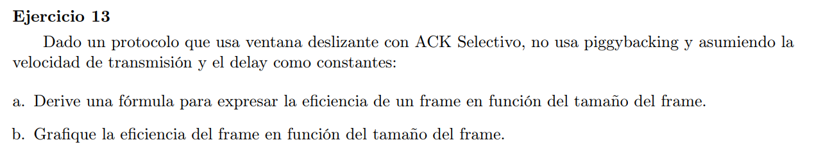
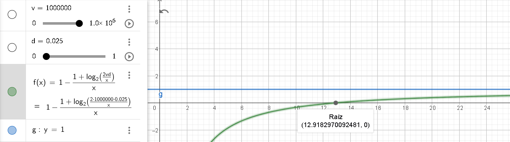

La eficiencia del frame está dado por: $e=\frac{\text{largo de los datos}}{\text{largo total del frame}}$

### a

Segun la velocidad de transmisión y el delay tenemos una capacidad de canal en bits. Ahora según el tamaño del frame (en bits) se determinará cuantos frames se pueden mandar por el canal. Mientras más chico el frame, más frames se podran mandar a costo de tener que tener más bits de identificación.

El frame con ACK selectivo sin piggybacking sería #seq;datos para el emisor, y #ack;#sack para el receptor, donde la cantidad de bits para sack es la misma que para ack.

Cuando estamos en un esquema de ACK selectivo $RWS = SWS$. Entonces tenemos

$RWS = SWS = \frac{V_{tx} * RTT}{|frame|} = \frac{V_{tx} * 2*Delay}{|frame|}$

Para evitar los problemas de reencarnación necesitamos que $cant-frames \geq SWS + RWS$

Luego la cantidad de bits que use para secuenciar los frames será $b=\lceil log_2(SWS + RWS) \rceil = \lceil log_2(2*SWS) \rceil = \lceil 1 + log_2(SWS) \rceil$

Y la eficiencia del frame emisor será $\frac{f-b}{f}$ donde $f = |frame|$. Reescribiendo la formula en función del tamaño del frame $f$:

$$e(f) = 1 - \frac{1+log_2(\frac{2*V*D}{f})}{f}$$

 
### b

con $v=1000, d=0.025$ para el emisor

Donde el eje $x$ corresponde a tamaños de frame y el eje $y$ a la eficiencia. Los valores de $y<0$ corresponden a tamaños de frame menores a la cantidad de bits necesarias para poder secuenciar la cantidad de frames que el esquema tendría (al haber un tamaño muy chico, entrarian muchos frames al mismo tiempo en el canal, necesitando más bits para identificarlos. Tantos que no alcanzaría con los del tamaño del frame). 
