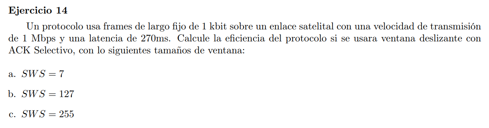

Eficiencia del protocolo = $\frac{T_{tx}}{RTT}$

largo frame $= 1kb$;  $V_{tx}=1Mbps$;  $Delay = 270ms$

$SWS = \frac{ V_{tx} *RTT}{|frame|}$

$\frac{SWS * |frame|}{RTT} = V_{tx} = \frac{1}{T_{tx}}$

$\frac{RTT}{SWS * |frame|} = T_{tx}$

### a

$T_{tx} = \frac{0.54s}{7*1000}$

### b

### c