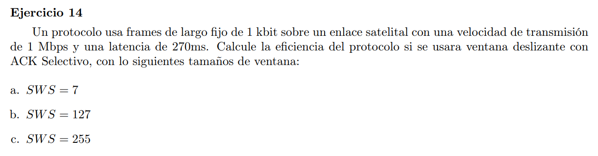

Eficiencia del protocolo = $\frac{T_{tx}}{RTT}$ (tiempo de tx de una ventana sobre RTT)

- $|frame|= 1kb$
- $V_{tx}=1Mbps$
- $Delay = 270ms$

Teniendo la cantidad de frames de la ventana, calculamos cuanto tarda en enviarse dicha cantidad de frames

$T_{tx} = \frac{SWS*|frame|}{V_{tx}}$

$RTT = 2 * Delay = 2 * 270ms = 0.540s$

### a

$T_{tx} = \frac{7*1000bit}{1Mbps} = 0.007s$

$\eta_{frame} = \frac{0.007s}{0.540s} = 0.013$

### b

$T_{tx} = \frac{127*1000bit}{1Mbps} = 0.127s$

$\eta_{frame} = \frac{0.127s}{0.540s} = 0.235$

### c

$T_{tx} = \frac{255*1000bit}{1Mbps} = 0.255s$

$\eta_{frame} = \frac{0.255s}{0.540s} = 0.472$