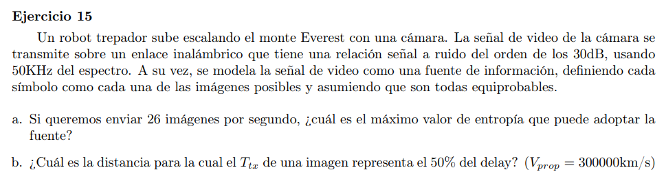

- Relación señal ruido a $30dB$
- Ancho de banda $50KHz$
- Cada imagen es un simbolo de la fuente, todas equiprobables

### a

Queremos velocidad de 26 IMGps. Por lo que la velocidad de transmisión (en bps) debe soportar minimo dicho requerimiento. Es decir 

$V_{tx} \geq L * 26 \text{bps}$ Donde $L(bits)$ es el tamaño medio en bits de una imagen. y por lo tanto $L \leq V_{tx}/26$

Como tambien sabemos que se debe cumplir $H(S) \leq L(C)$ para no tener perdida de información, con $H(S)$ la entropía de la fuente y $L(C)$ el largo promedio del código, entonces $H(S) \leq V_{tx}/26$

Y como queremos el máximo valor de entropía usamos el teorema de shanon para la capacidad de canal, viendo que $V_{tx} \leq C = B * log_2(1+10^{SNR/10})$

$V_{tx} = 50KHz * log_2(1+10^{30/10}) \approx 498.36 Kbps$

Luego la entropía máxima es $H(S) = 498.36 Kbps / 26s = 19.168 Kb $

### b

$V_{prop} = 300000km/s$

$V_{tx} = 498.36 Kbps$

$T_{tx} = |imagen|/V_{tx}$ (porque enunciado pide de una imagen)

$T_{prop} = D/V_{prop}$

$Delay = T_{tx} + T_{prop}$

$0.5 *Delay = T_{tx} \iff Delay = 2 * T_{tx}$

Entonces $2*T_{tx} = T_{tx} + T_{prop} \iff T_{tx} = T_{prop} \iff \frac{|imagen|}{V_{tx}} = \frac{D}{V_{prop}}$

Donde $|imagen| = L(C) \geq H(S) = 19.168Kb$

Luego $D = \frac{|imagen| \cdot V_{prop}}{V_{tx}} = 11,538.64km$
