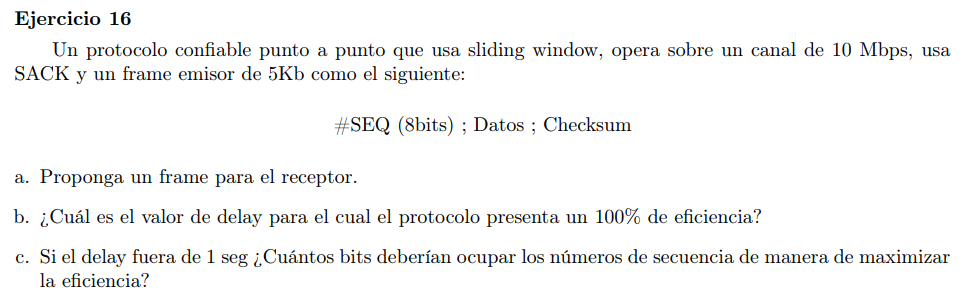

### a

#ACK(8bits);#SACK(8bits);Checksum

### b

$\eta_{proto}=\frac{T_{tx}(ventana)}{RTT(frame)}$

$1 = \frac{|ventana|}{V_{tx}} \cdot \frac{1}{delay_{emisor} + delay_{receptor}} \iff delay_{emisor} + delay_{receptor} = \frac{|ventana|}{V_{tx}}$

Como tenemos por enunciado que son 8 bits para identificar los frames, entonces podemos identificar 256 frames. Como queres evitar problemas de reencarnación y estamos en un esquema SACK entonces SWS = RWS = 128. Luego $|ventana|(bits) = 128 \cdot 5kb$

$delay_{emisor} + delay_{receptor} = \frac{128 \cdot 5kb}{10Mbps} = 0.064s$

Como el tiempo de transmisión de los frames son despreciables, podemos decir que $delay_{emisor} \approx delay_{receptor}$ y queda que el $delay = 0.032s$

### c

$SWS = \frac{V_{tx} \cdot 2 \cdot delay}{|frame|} = \frac{10Mbps \cdot 2 \cdot 1}{5kb} = 4000$ 

Y como estamos en SACK $SWS = RWS = 4000$ por lo que se necesita identificar univocamente al menos 8000 frames para evitar rencarnaciones. Entonces se necesita $\lceil log_2(8000) \rceil = 13bits$