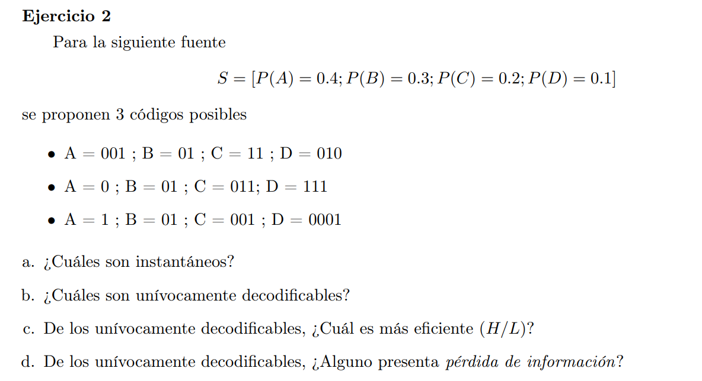
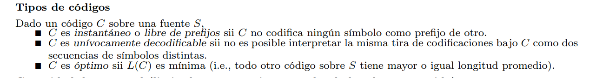

### a

Solo el tercero es instantaneo. El primero, B es prefijo de D. El segundo B es prefijo de C

### b

El primero no es: DB = 01001 = AB
El segundo es univocamebte deco (en la practica lo dijeron)
El tercero es instantaneo, por lo que es univocamente decodificable

### c

$L(C_2) = 1.9$
$L(C_3) = 2$
$H(S) = 1.84$

El de mayor eficiencia es $C_2$ al tener un código más pequeño la relación $H/C$ es mayor

### d

De los univocamente deco, ninguno presenta perdidas de información ya que su longitud promedio es mayor a la entropía de la fuente.