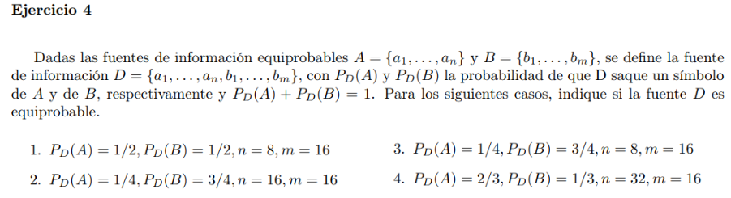

Tenemos que ver si todos los elementos de D tienen la misma probabilidad de ser emitidos por la fuente.

### 1
Suponiendo que elegir un elemento de A o de B es equiprobable

$ P_D(a_i) = P_D(A) P_A(a_i) = \frac{1}{2} \frac{1}{8} = \frac{1}{16} $

$ P_D(b_i) = P_D(B) P_B(b_i) = \frac{1}{2} \frac{1}{16} = \frac{1}{32} $

Por lo tanto D no es equiprobable

### 2

$ P_D(a_i) = P_D(A) P_A(a_i) = \frac{1}{4} \frac{1}{16} = \frac{1}{64} $

$ P_D(b_i) = P_D(B) P_B(b_i) = \frac{3}{4} \frac{1}{16} = \frac{3}{64} $

No es equiprobable

### 3

$ P_D(a_i) = P_D(A) P_A(a_i) = \frac{1}{4} \frac{1}{8} = \frac{1}{32} $

$ P_D(b_i) = P_D(B) P_B(b_i) = \frac{3}{4} \frac{1}{16} = \frac{3}{64} $

No es equiprobable

### 4

$ P_D(a_i) = P_D(A) P_A(a_i) = \frac{2}{3} \frac{1}{32} = \frac{1}{48} $

$ P_D(b_i) = P_D(B) P_B(b_i) = \frac{1}{3} \frac{1}{16} = \frac{1}{48} $

D es equiprobable