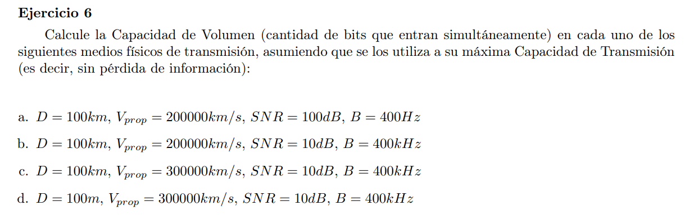
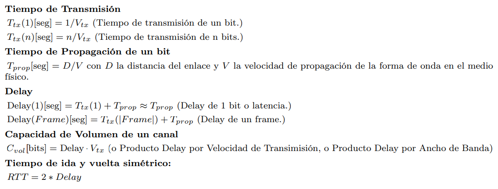

Si se usa al máximo la capacidad de transmición luego $V_{tx} = C = B * log_2(1+SNR)$

### a

$V_{tx} = C = 400 * log_2(1 + 10^{100/10}) \approx 13.288 bps $

$Delay = T_{tx}(1) + T_{prop} = \frac{1}{V_{tx}}  + \frac{D}{V_{prop}} = \frac{1}{13.288}  + \frac{100}{200000} \approx 0.0005 seg $ 

$C_{vol} = V_{tx} * Delay = 13.288 * 0.0005 = 6.64bits     $

### b

$V_{tx} = C = 400000 * log_2(1 + 10^{10/10}) \approx 1.383.773 bps $

$Delay  \approx T_{prop} =  \frac{D}{V_{prop}} = \frac{100}{200000} \approx 0.0005 seg $ 

$C_{vol} = V_{tx} * Delay = 1.383.773 * 0.0005 = 692bits $

### c

$V_{tx} = C = 400000 * log_2(1 + 10^{10/10}) \approx 1.383.773 bps $

$Delay  \approx T_{prop} =  \frac{D}{V_{prop}} = \frac{100}{300000} \approx 0.0003 seg $ 

$C_{vol} = V_{tx} * Delay = 1.383.773 * 0.0003 = 461bits $

### d

$V_{tx} = C = 400000 * log_2(1 + 10^{10/10}) \approx 1.383.773 bps $

$Delay  \approx T_{prop} =  \frac{D}{V_{prop}} = \frac{0.1}{300000} \approx 0.0000003 seg $ 

$C_{vol} = V_{tx} * Delay = 1.383.773 * 0.0000003 = 0.461bits $