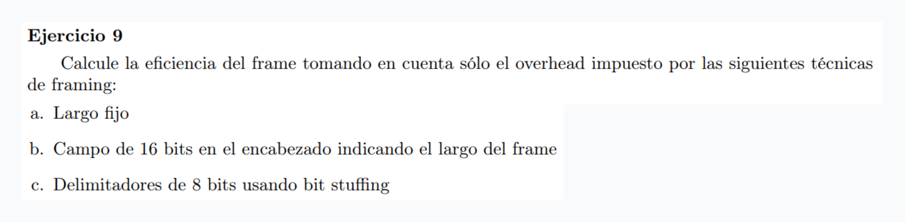
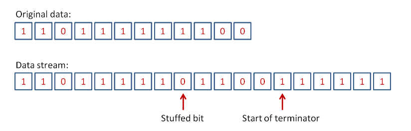

$ \text{eficiencia} = \frac{\text{largo datos}}{\text{largo frame}}$

$\text{largo frame} =f$

### a

$\frac{f}{f} = 1$

### b

$\frac{f-16}{f}$

### c

$\frac{f-8-m}{f} = 1$

Siendo m la cantidad de bits adicionales agregados por el stuffing

Bit stuffing: Se define una secuencia de bits como delimitador y se envian los datos entre 2 delimitadores < delim, dato, delim >. Si como dato queremos enviar justo el valor del delimitador, entonces se agregan bits siguiendo ciertas reglas que luego el receptor puede usar para inferir el mensaje. Por ejemplo: delimitador = 111111:

Se agregó un bit más. En general la eficiencia se da por $$ \frac{largo \ frame - n - m}{largo \ frame} $$ donde m es el tamaño del delimitador (solo se cuenta 1 delimitador porque el prefijo de un frame es el sufijo del anterior) y n es la cantidad de bits que se agregan para diferenciar con el delimitador.