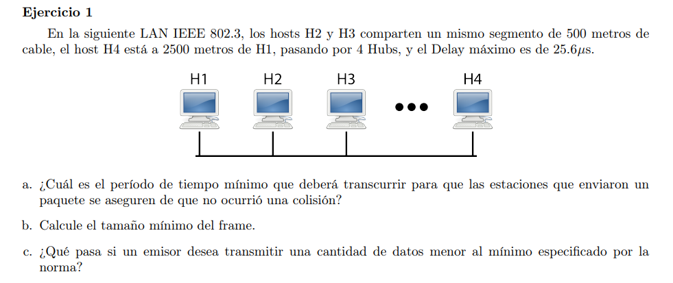

## a
[Explicación colisiones en LAN](https://www.opentextbooks.org.hk/ditatopic/3610)

El protocolo de comunicación establece reglas para comunicar hosts que comparten un medio en el que se deben turnar para poder transmitir. Es decir, no pueden transmitir al mismo tiempo. Un host sensa el medio, si lo nota desocupado transmite. El problema se dá cuando sensa el medio y no detecta que está ocupado porque el paquete que otro host le envió todavía no le llegó (por el tiempo de propagación). Esto podría genera colisiones.

Un host para poder detectar que su paquete sufrió de colisión debe estar transmitiendo para que dicha colisión le llegue y pueda comparar las señales y así darse cuenta.

Como queremos el tiempo mínimo que debe esperar un host que envió un paquete para aseguarar que no colisionó, tenemos que calcular la cantidad de tiempo en el peor caso. Éste sería cuando el host A transmite en un tiempo t0, y un host B transmite en un tiempo t0 + MAX - tj donde MAX es el tiempo máximo de propagación y tj es un tiempo cercano a 0 (de tal forma que cuando va a transmitir todavía no llega el paquete de A y sensa el medio libre). En el caso descripto se produce una colisión en un lugar cercano a B y se debe propagar hasta A.

Entocnes el $t_{min} = t_{colision} + MAX = MAX - tj + MAX = 2*MAX$, ya que dijimos que tj es muy chico, y no tomamos el tiempo t0 porque nos importa la cantidad de tiempo, y no relativo a cuando ocurrió.

En este caso particular $MAX = 25.6 \mu s$ por lo tanto $t_{min} = 2 * 25.6 = 51,2\mu s$

## b

Tenemos que esperar un tiempo mínimo (51,2\mu s) para detección de colisiones, y en dicho tiempo tenemos que transmitir alguna señal. La velocidad del protocolo es de $10Mbps$ por lo que necesitamos transmitir por lo menos 512bits = 64Bytes

## c

Podría pasar que se generase una colisión y el host emisor no pueda detectarla. Se podría agregar padding al mensaje para cumplir el tamaño mínimo. Luego se debe tener un mecanismo para descartar el padding

## d

H2 y H3 detectarían el medio ocupado. Como el protocolo es 1-persistent, entonces quedan en constante senso del medio hasta que se descupe y cuando ocurre, envian sus respectivos frames. Ambos, por su cercanía, van a detectar que el medio está libre en momentos cercanos, van a transmitir sin darse cuenta que el otro ocupó el medio y sus paquetes colisionaran.

## e

Como el tiempo de propagación máximo es de $51,2\mu s$ existe la posibilidad de que el host 4 no le llegue en el tiempo $t0 + 2\mu s$ que el host 1 está transmitiendo, sensará el medio libre, enviará su paquete y colisionará.
