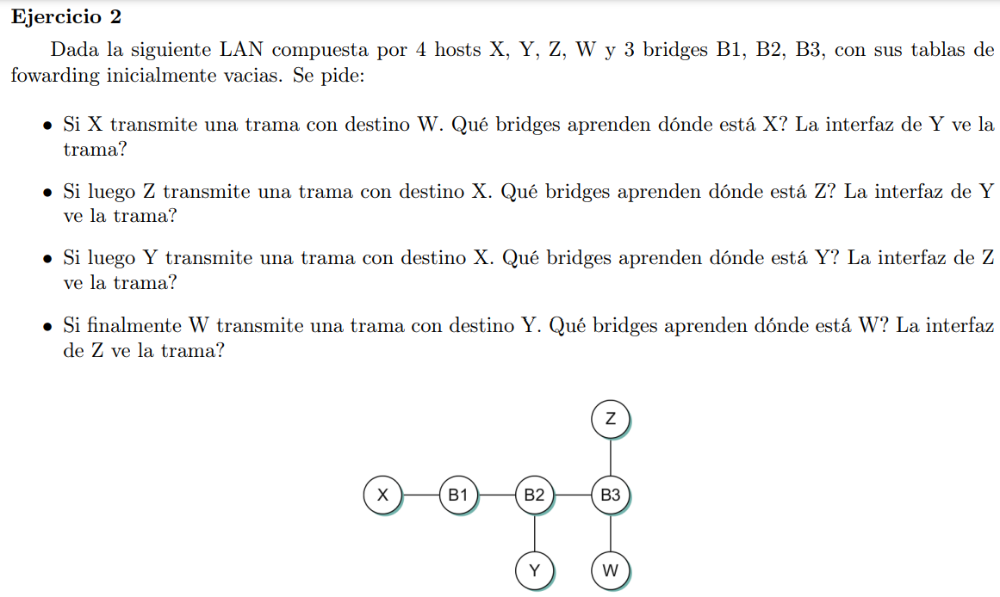

- B1, B2, B3. El nodo Y vé la trama ya que B2 le forwardea el paquete al no saber donde está W. (realmente todos los nodos de la red terminan viendo la trama).
- B3, B2, B1. La interfaz de Y no ve la trama ya que los bridges ya saben donde está X por lo que solo forwardean por las interfaces necesarias.
- B2, B1. La interfaz Z no ve la trama
- B3, B2. Z vé la trama porque B3 no conoce al nodo Y y debe forwardear por todas sus interfaces.