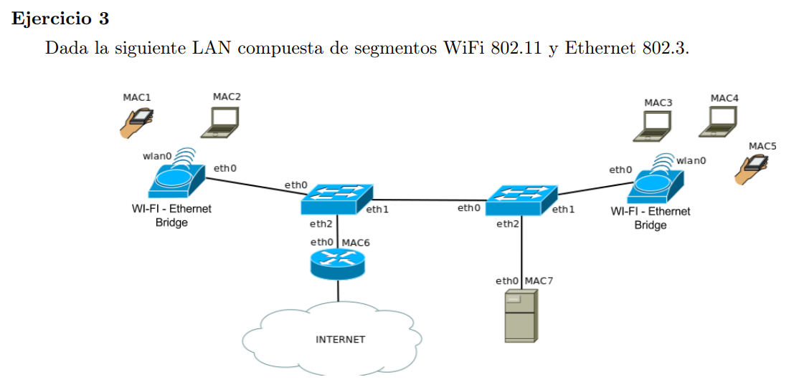
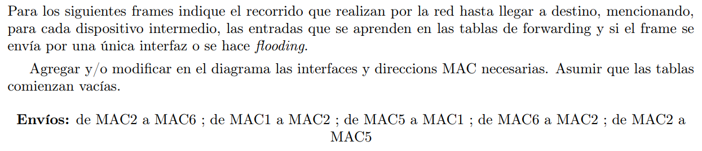

Siendo en orden de izquierda a derecha en la imagen

bridge1---bridge2---bridge3---bridge4

Dejabo de bridge2, router1

### MAC2 a MAC6  

Se genera por flooding

|    | m1 | m2    | m3 | m4 | m5 | m6 | m7 |
|----|----|-------|----|----|----|----|----|
| b1 |    | wlan0 |    |    |    |    |    |
| b2 |    | eth0  |    |    |    |    |    |
| b3 |    | eth0  |    |    |    |    |    |
| b4 |    | eth0  |    |    |    |    |    |
| r1 |    | eth0  |    |    |    |    |    |

### MAC1 a MAC2

b1 ya sabe donde está MAC2 por lo que no floodea y aprende donde está MAC1

|    | m1    | m2    | m3 | m4 | m5 | m6 | m7 |
|----|-------|-------|----|----|----|----|----|
| b1 | wlan0 | wlan0 |    |    |    |    |    |
| b2 |       | eth0  |    |    |    |    |    |
| b3 |       | eth0  |    |    |    |    |    |
| b4 |       | eth0  |    |    |    |    |    |
| r1 |       | eth0  |    |    |    |    |    |

### MAC5 a MAC1

Todos los bridges y router aprenden donde está MAC5 por flooding

|    | m1    | m2    | m3 | m4 | m5    | m6 | m7 |
|----|-------|-------|----|----|-------|----|----|
| b1 | wlan0 | wlan0 |    |    | eth0  |    |    |
| b2 |       | eth0  |    |    | eth1  |    |    |
| b3 |       | eth0  |    |    | eth1  |    |    |
| b4 |       | eth0  |    |    | wlan0 |    |    |
| r1 |       | eth0  |    |    | eth0  |    |    |

### MAC6 a MAC2

r1 ya conoce su propia MAC, b2 aprende donde está MAC6 y forwardea porque ya sabe donde está MAC2. Equiv b1

|    | m1    | m2    | m3 | m4 | m5    | m6   | m7 |
|----|-------|-------|----|----|-------|------|----|
| b1 | wlan0 | wlan0 |    |    | eth0  | eth0 |    |
| b2 |       | eth0  |    |    | eth1  | eth2 |    |
| b3 |       | eth0  |    |    | eth1  |      |    |
| b4 |       | eth0  |    |    | wlan0 |      |    |
| r1 |       | eth0  |    |    | eth0  | -    |    |

### MAC2 a MAC5

Todos los bridges y router saben donde está m2 y m5, por lo que forwardean la trama y no se aprende nada nuevo.
