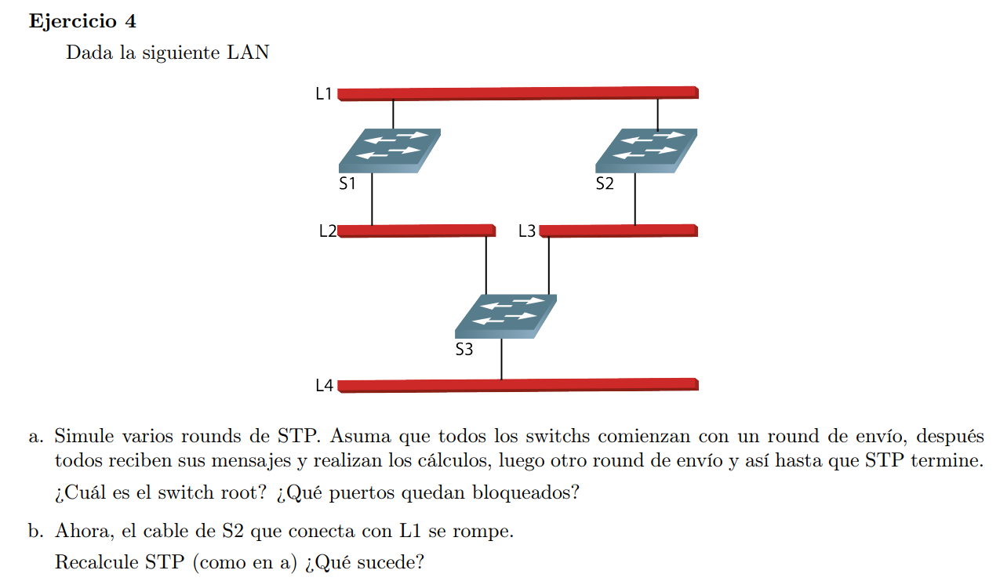
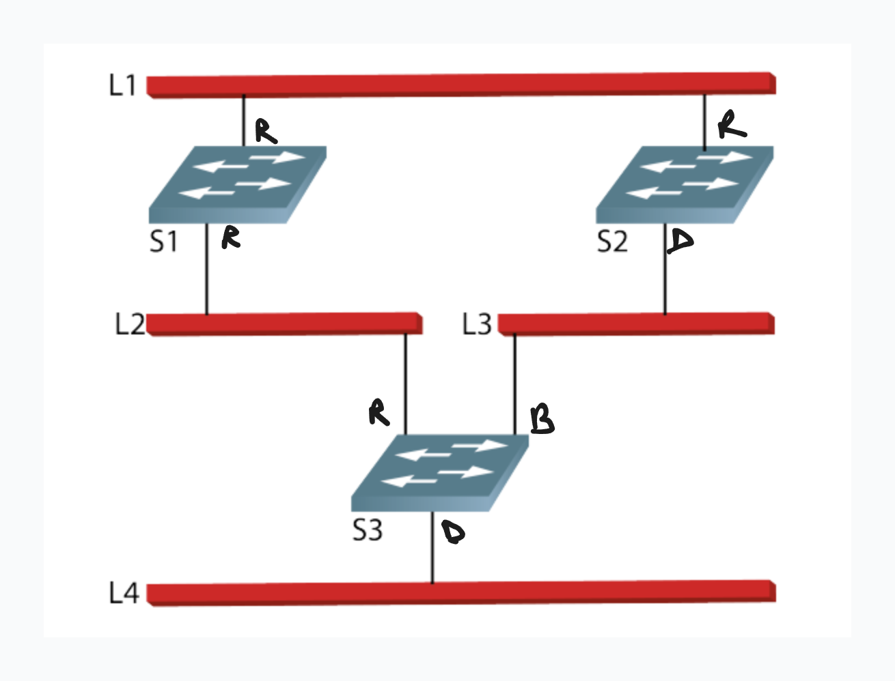

Inicialmente todos los bridges empiezan como root y envian mensajes a todas las LAN que tienen conectadas

Los mensajes que se envian tiene el formato de (ID1, ID2, distancia) donde ID1 es el ID del que envió el mensaje, ID2 el nodo que piensa que es el root y la distancia hacia el root.

Cada nodo toma la información que le llega, compara con la que tiene y calcula el mejor root tomando el mensaje que tenga el menor ID2 (el root de menor ID), si tiene el mismo ID2 entonces se fija el de menor distancia, y si ambos coinciden se fija si el ID1 (el que le envió el mensaje es menor) es menor.

Si la info que le llega es mejor que la que tiene, descarta, guarda la nueva y la reenvia sumandole 1 a la distancia.

Cuando un bridge ya sabe que no es root deja de enviar mensajes de configuración y solo forwardea las que le llegan (quedandose con el mejor y actualizando la distancia)

### a

S1 envia (S1, S1, 0) a S2 y S3
S2 envia (S2, S2, 0) a S1 y S3
S3 envia (S3, S3, 0) a S1 y S2

S1 queda como el root por ser el de menor ID
S2 acepta a S1 como root
S3 acpeta a S1 como root

S3 envia (S3, S1, 1) a S2
S2 envia (S2, S1, 1) a S3

Luego el puerto que conecta a S3 con L3 queda bloqueado ya que S2 tiene un ID menor que S3 y por lo tanto queda como bridge designado para dicha LAN

### b

Periodicamente en la red se mandan mensajes de configuración (cuando converge la red solo el root manda y el resto forwardea)

S1 manda (S1, S1, 0)
S3 manda (S3, S1, 1)
S2 recibe esto, actualiza sus interfaces y manda a S3 (S2, S1, 2)
S3 cambia el puerto bloqueado a designado

 

