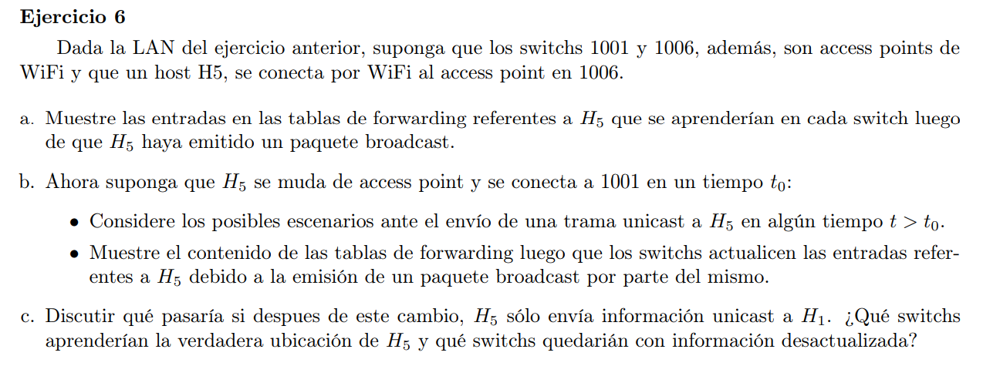

### a

(voy a tomar el punto a y b del ejercicio anterior). Queda:

|      | h1 | h2 | h3 | h4 | h5   |
|------|----|----|----|----|------|
| 1001 | 1  | 2  | 1  | 2  | 2    |
| 1002 | 1  | 1  | 2  | 1  | 1    |
| 1003 | 1  | 1  | 1  | 1  | 1    |
| 1004 | 1  | 1  | 1  | 1  | 3    |
| 1005 | 1  | 1  | 1  | 2  | 2    |
| 1006 | 1  | 1  | 1  | 1  | wlan |

### b

Si h5 se conecta a 1001 (asumiendo que 1001 no actualiza su tabla de forwarding hasta que h5 no envie algo), entonces la red no se da cuenta de este cambio y erroneamente le llegaran paquetes a 1006 con destino a h5.

Cuando h5 realice un mensaje de broadcast las tablas de forwarding quedaran de la siguiente manera:

|      | h1 | h2 | h3 | h4 | h5   |
|------|----|----|----|----|------|
| 1001 | 1  | 2  | 1  | 2  | wlan |
| 1002 | 1  | 1  | 2  | 1  | 1    |
| 1003 | 1  | 1  | 1  | 1  | 1    |
| 1004 | 1  | 1  | 1  | 1  | 1    |
| 1005 | 1  | 1  | 1  | 2  | 1    |
| 1006 | 1  | 1  | 1  | 1  | 1    |

### c

Solo lo aprenderian la ubicación verdadera de h5 el bridge 1001. El frame le llegaría a 1002 pero como le llega por la misma interfaz por la que había aprendido, no necesita hacer ningún cambio y no le avisa al bridge 1003 tampoco.

Los bridges 1002 y 1004 quedan con información desactualizada. El siwtch 1006???? (si se da cuenta que se desconectó h5 lo borra de su tabla de forwarding?)