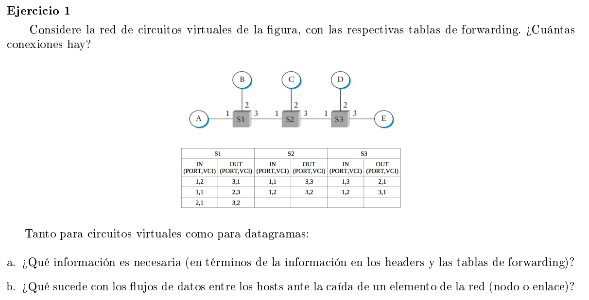

En las redes donde se establecen circuitos virtuales en los switches se reservan en cada uno recursos para establecer una conexión. Una vez establecido, los paquetes siempre viajan por dicho camino. Dentro de un switch puede haber muchos circuitos virtuales.

Cada switch tiene una tabla de Virtual Connections con entradas:

- VCI (Virtual Conn Identifier)
- Interface entrada: puerto por el que van a entrar paquetes de dicho circuito virtual
- Interface salida: puerto de salida por el que hay que mandar el paquete
- VCI salida: el identificador del circuito virtual que tiene asociado el siguiente switch del circuito

El circuito virtual se puede establecer

- De forma permanente mediante la intervención de un administrador que arme la conexión virutal (PVC, permanent VC). El circuito lo da de baja el admin.
- Por solicitud, donde un host manda paquetes de configuración por la red y los switches la atienden para armar el VC (si pueden: si tienen los recursos necesarios para reservar). Cuando se establece el VC (normalmente tarda RTT) ahí se pueden enviar datos. Se cierra la conexión tambien por solicitud: dicho paquete va viajando por los switches y estos van borrando las entradas de su tabla.

Por ejemplo el switch S1 tiene en su tabla que por el puerto 1 pueden venir paquetes del circuito virtual 2 (VCI 2) y debe forwardearlos por el puerto 3 con un VCI de 3 (es decir debe cambiar el header antes de enviarlo).

En el esquema hay 3 conexiones:

- Toda la primer fila es un circuito virtual que conecta A con E
- La segunda fila de S1 es un VC que conecta A con B
- La tercer fila de S1 con las segundas filas de S2 y S3 conectan B con E

### a

En la tabla debe haber por cada VC que pase por el swtitch, una entrada con el puerto de entrada del VC, el identificador correspondiente, el puerto de salida, y el identificador del VC que tiene el switch siguiente en la conexión.

En los headers tiene que estar además de la dirección del host destino, el VCI del siguiente switch por el cual se va a enviar. Es decir que los nodos deben conocer tanto las MAC address de los hosts con los que se quiere comunicar, como los VCI de los circuitos virtuales que estableció.

### b

Si un switch se cae, sus circuitos virtuales tambien fallan y se deben establecer nuevas conexiones. (Volver a armar de 0 los circuitos virtuales)

Si se cae un enlace entre switches, solo se pierden los circuitos virtuales correspondientes a dicho enlace. Es decir, que podrían ser menos los circuitos a re-establecer.