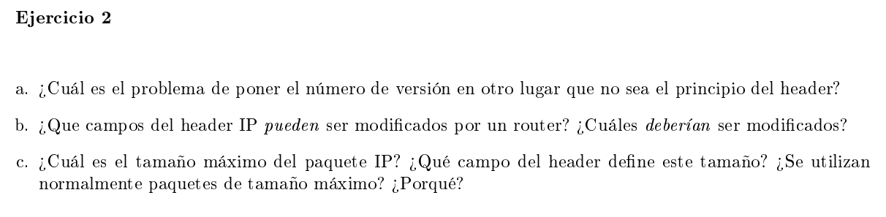
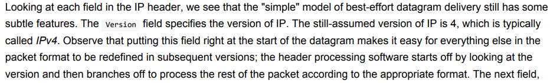
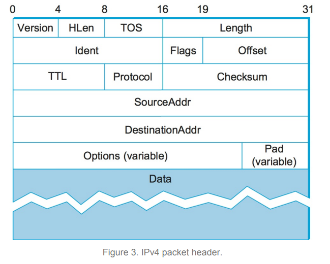

### a

Basicamente poniendo la version al principio podes re-estructurar el header como quieras para distintas versiones. Los que procesan el encabezado mira la version que son los primeros 4 bits y ya sabe como seguir procesando.

### b

Los campos del header son:

{width=50%}

- HLEN: tamaño del header que puede variar según si se agrega opciones o no (si no hay opciones se agrega padding)
- TOS: type of service, como tratar el paquete. Por ejemplo ponerlo en una queue de bajo delay.
- Length: el tamaño en bytes del datagrama (incluyendo el header). Este puede tener un tamaño de hasta 65535 bytes
- Ident: campo para identificar datagramas cuando se fragmentan (esto se hace cuando el MTU (Max Transmission Unit) de la red física por el cual se va a enviar es menor que el tamaño del datagrama). Todos los fragmentos tienen el mismo identificador.
- Offset: se usa para reensamblar los paquetes fragmentados (identifica offsets de a 8 bytes, con 13 bits obtenemos los 65535 bytes máximos)
- TTL: time to live, por cada router que pasa el datagrama se decrementa en 1 antes de volver a forwardearlo. Si llega a 0 se descarta y no se reenvia. Esto se pone porque en la capa de red se pueden haber loops, y para evitar que los paquetes circulen por la red infinitamente se descartan luego de cierta cantidad de hops.
- Protocol: identifica el protocolo de la capa superior que va a usar este paquete
- Checksum: un hash para control de errores
- Dirección IP del source y destination. 

Un router puede modificar los flags, el Ident, offset y el Length si decide fragmentar, TTL, checksum (por cada hop decrementa el ttl y recalcula), HLEN y TOS si decide agregar alguna opción (esto último no estoy seguro)

No modifica las direcciones de source y destination.

Debe modificar TTL y Checksum

El header puede medir hasta 60bytes con las opciones.

### c

El tamaño máximo es de 65535 bytes ya que el campo Length es de 16 bits y 2^16 = 65535.

Puede que no se use siempre el tamaño máximo ya que la idea es poder interconectar distintas redes con capacidades físicas distintas. En particular que no soporten el envio de paquetes tan grandes. Por lo tanto se fragmentan y se reordenan en el host destino.

Los fragmentos tienen el mismo encabezado que el datagrama original, así como el mismo identificador para que el destino pueda rearmarlos. La unidad básica de fragmentación es de 8 bytes, es decir que los datos del paquete fragmentado pueden tener tamaño 60+ 8*k con k > 0. Por lo tanto toda red debe soportar un MTU >= 68 bytes.
