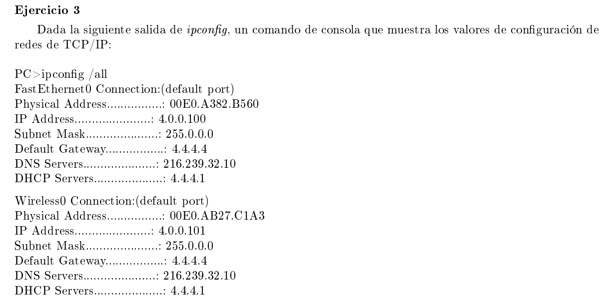
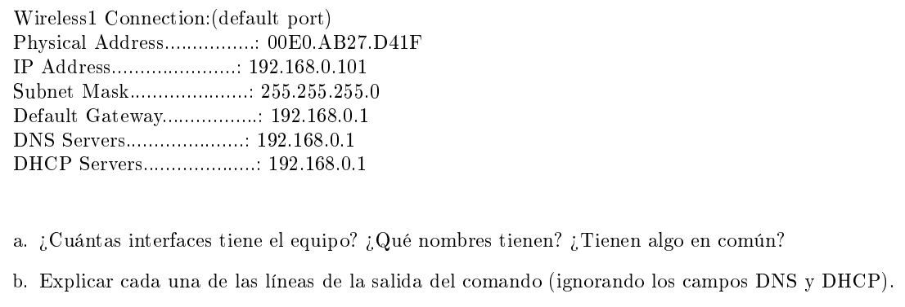

### a

Tiene 3 interfaces: FastEthernet0, Wireless0, Wireless1.

Tienen en comun la mascara de subred, la puerta de enlace predeterminada, el servidor DNS y el servidor DHCP.

### b

Phisical address: La dirección MAC del dispositivo de red

La mascara de red que identifica la parte de la IP que corresponde a la red y la parte que corresponde al host. Para Ethernet0 y Wireless0 tenemos que el primer byte corresponde a la red y los otros 3 al host. Para Wireless1 los primeros 3 a la red y el último al host.

FastEthernet0 y Wireless0 tienen direcciones IP públicas y están en la misma red. Wireless1 tiene una dirección IP privada.

FastEthernet0 y Wireless0 tienen el mismo default gateway. Wireless1 tiene otro.