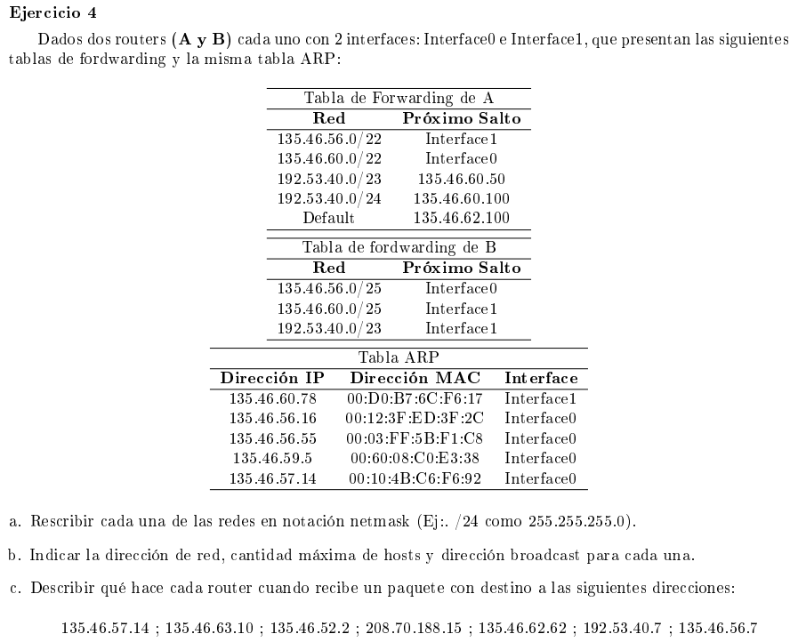

### a

- /22 : 255.255.252.0
- /23 : 255.255.254.0
- /24 : 255.255.255.0
- /25 : 255.255.255.128 


### b

Para obtener la dirección de red hacemos el and bitwise entre la IP y la mascara. 

Para la cantidad máxima de hosts tomamos los bits B de la dirección que quedarían para direccionar host y hacemos 2^B

La dirección de broadcast es poner todos los bits del espacio host en 1s.

#### TABLA A 

##### 135.46.56.0/22

```
135.46.56.0 band 255.255.252.0 = 
10000111.00101110.001110 00.00000000    direccion IP
11111111.11111111.111111 00.00000000    mascara

10000111.00101110.001110 00.0000000     dirección red = 135.46.56.0

cantidad de hosts: 2^10 - 2 = 1022

10000111.00101110.001110 11.11111111    dirección broadcast = 135.46.59.255
```

##### 135.46.60.0/22

```
10000111.00101110.001111 00.00000000    direccion IP
11111111.11111111.111111 00.00000000    mascara

10000111.00101110.001111 00.00000000     dirección red = 135.46.60.0

cantidad de hosts: 2^10 - 2 = 1022

10000111.00101110.001111 11.11111111    dirección broadcast = 135.46.63.255
```

##### 192.53.40.0/23

```
11000000.00110101.0010100 0.00000000    direccion IP
11111111.11111111.1111111 1.00000000    mascara

11000000.00110101.0010100 0.00000000     dirección red = 192.53.40.0

cantidad de hosts: 2^9 - 2 = 510

11000000.00110101.0010100 1.11111111    dirección broadcast = 192.53.41.255

```

##### 192.53.40.0/24

```
11000000.00110101.00101000 .00000000    direccion IP
11111111.11111111.11111111 .00000000    mascara

11000000.00110101.00101000 .00000000     dirección red = 192.53.40.0/24

cantidad de hosts: 2^8 - 2 = 254

11000000.00110101.00101000 .11111111    dirección broadcast = 192.53.40.255

```

#### TABLA B

##### 135.46.56.0/25

```
10000111.00101110.00111000.0 0000000    direccion IP
11111111.11111111.11111111.1 0000000    mascara

10000111.00101110.00111000.0 0000000    dirección red = 135.46.56.0/25

cantidad de hosts: 2^7 - 2 = 126

10000111.00101110.00111000.0 1111111    dirección broadcast = 135.46.56.127
```

##### 135.46.60.0/25

```
10000111.00101110.00111100.0 0000000    direccion IP
11111111.11111111.11111111.1 0000000    mascara

10000111.00101110.00111100.0 0000000    dirección red = 135.46.60.0/25

cantidad de hosts: 2^7 - 2 = 126

10000111.00101110.00111100.0 1111111    dirección broadcast = 135.46.60.127
```

##### 192.53.40.0/23

```
11000000.00110101.0010100 0.00000000    direccion IP
11111111.11111111.1111111 0.00000000    mascara

11000000.00110101.0010100 0.00000000    dirección red = 192.53.40.0/23

cantidad de hosts: 2^9 - 2 = 510

11000000.00110101.0010100 1.11111111    dirección broadcast = 192.53.41.255
```


### c

El algoritmo que sigue cada router es el siguiente:

```
D = destination IP address
for each forwarding table entry
    (SubnetNumber, SubnetMask, NextHop)
    D1 = SubnetMask & D
    if D1 = SubnetNumber
        if NextHop is an interface
            deliver datagram directly to destination
        else
            deliver datagram to NextHop (a router)

```


#### 135.46.57.14

Para el router A matchea con la primer entrada, por lo que envia directamente el datagrama por la interfaz1. Para ello resuelve en la tabla ARP con que dirección MAC hay que mandar el paquete.

Para el router B no matchea con ninguna entrada por lo que descarta el datagrama

#### 135.46.63.10 

Matchea con la segunda entrada del router A, envia por la interfaz0 viendo la dirección MAC en la tabla ARP. No hay match para la tabla B, por lo que descarta el datagrama.

#### 135.46.52.2 

Para el router A matchea con el default y lo forwardeará por la dirección 135.46.62.100. Para B no hay match

#### 208.70.188.15 

#### 135.46.62.62 

#### 192.53.40.7 

#### 135.46.56.7

