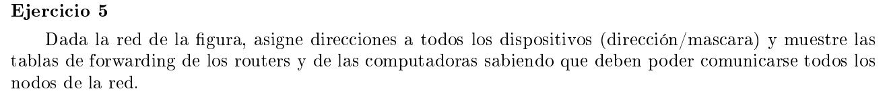
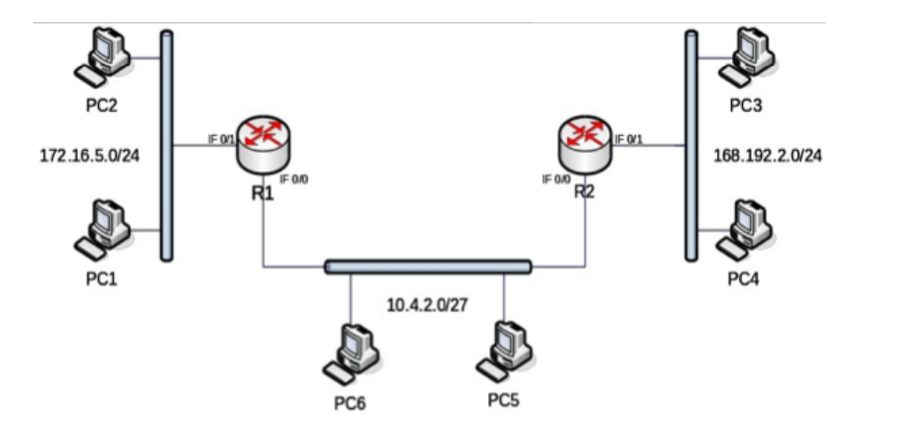

Para la red 1 tenemos que la dirección de red es 172.16.7.0 y la mascara es /24 o 255.255.255.0 por lo que el último byte de la dirección corresponde a la parte del host. El 0 identifica la red y 255 es la dirección de broadcast. 

```
PC1:        172.16.7.1
PC2:        172.16.7.2
R1_IF0/1:   172.16.7.3
```

Analogamente para la red 168.192.2.0 con mascara /24

```
PC3:        168.192.2.1
PC4:        168.192.2.2
R2_IF0/1:   168.192.2.3
```

Para la red 10.4.2.0/27 tenemos una mascara de 255.255.255.224  

Los ultimos 5 bits del último byte identifican hosts, con 0 el identificador de la red y 32 la dirección de broadcast

```
PC5:        00001010.00000100.00000010.000 00001 = 10.4.2.1
PC6:        00001010.00000100.00000010.000 00010 = 10.4.2.2
R1_IF0/0:   00001010.00000100.00000010.000 00011 = 10.4.2.3
R2_IF0/0:   00001010.00000100.00000010.000 00100 = 10.4.2.4
```

### Tabla forwarding router 1

| red              | next hop / Interface |
|------------------|----------------------|
| 172.16.7.0 / 24  | IF 0/1               |
| 168.192.2.0 / 24 | 10.4.2.4             |
| 10.4.2.0 / 27    | IF 0/0               |


### Tabla forwarding router 2

| red              | next hop / Interface |
|------------------|----------------------|
| 172.16.7.0 / 24  | 10.4.2.3             |
| 168.192.2.0 / 24 | IF 0/1               |
| 10.4.2.0 / 27    | IF 0/0               |