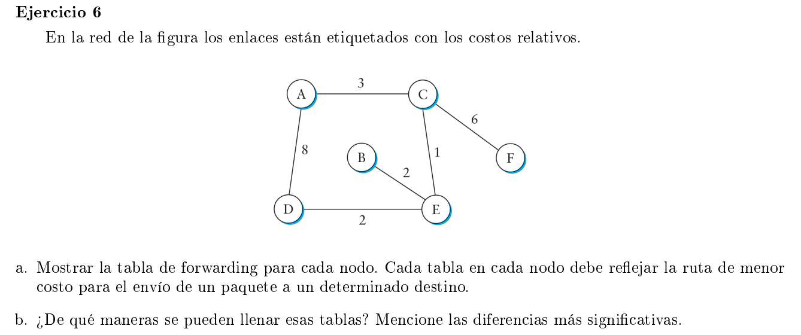

### a

#### A

En la siguiente tabla cada fila es el forwarding table correspondiente al nodo de la primer columna

|   | A | B | C | D | E | F |
|---|---|---|---|---|---|---|
| A | - | C | C | C | C | C |
| B | E | - | E | E | E | E |
| C | A | E | - | E | E | F |
| D | E | E | E | - | E | E |
| E | C | B | C | D | - | C |
| F | C | C | C | C | C | - |

### b

Las tablas se pueden llenar de manera

- Estática: un admin llena las tablas en forma manual al crear la red. Este enfoque es poco flexible: ante fallos la red no se adapta, y si se agrega o quita un nodo se debe actualizar todas las tablas en forma manual.
- Dinámica: los nodos van aprendiendo los distintos costos y los next hops a partir de ellos. Es más flexible, ante fallas se corre un algoritmo para recalcular caminos alternativos. De igual forma cuando se agrega o quita un nodo. También pueden cambiar sus caminos si encuentran uno más barato. Todo depende del algoritmo de enrutamiento que se utilice.