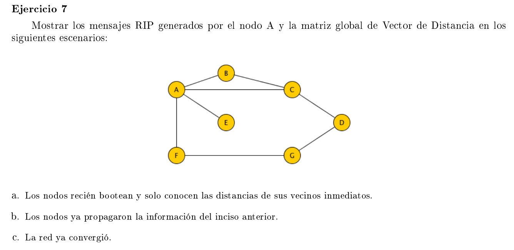

### a

Vamos a asumir que los costos de las aristas es 1. Por lo que se quiere minimizar la cantidad de hops.

|   | A | B | C | D | E | F | G |
|---|---|---|---|---|---|---|---|
| A| 0 | 1 | 1 | - | 1 | 1 | - | 
| B | 1 | 0 | 1 | - | - | - | - |
| C | 1 | 1 | 0 | 1 | - | - | - |
| D | - | - | 1 | 0 | - | - | 1 |
| E | 1 | - | - | - | 0 | - | - |
| F | 1 | - | - | - | - | 0 | 1 |
| G | - | - | - | 1 | - | 1 | 0 |

Tabla global, cada nodo solo conoce su fila

### b

El resultado de la primer iteración

|   | A | B | C | D | E | F | G |
|---|---|---|---|---|---|---|---|
| A | 0 | 1 | 1 | 2 | 1 | 1 | 2 |
| B | 1 | 0 | 1 | 2 | 2 | 2 | - |
| C | 1 | 1 | 0 | 1 | 2 | 2 | 2 |
| D | 2 | 2 | 1 | 0 | - | 2 | 1 |
| E | 1 | 2 | 2 | - | 0 | 2 | - |
| F | 1 | 2 | 2 | 2 | 2 | 0 | 1 |
| G | 2 | - | 2 | 1 | - | 1 | 0 |

### c

|   | A | B | C | D | E | F | G |
|---|---|---|---|---|---|---|---|
| A | 0 | 1 | 1 | 2 | 1 | 1 | 2 |
| B | 1 | 0 | 1 | 2 | 2 | 2 | 3 |
| C | 1 | 1 | 0 | 1 | 2 | 2 | 2 |
| D | 2 | 2 | 1 | 0 | 3 | 2 | 1 |
| E | 1 | 2 | 2 | 3 | 0 | 2 | 3 |
| F | 1 | 2 | 2 | 2 | 2 | 0 | 1 |
| G | 2 | 3 | 2 | 1 | 3 | 1 | 0 |

