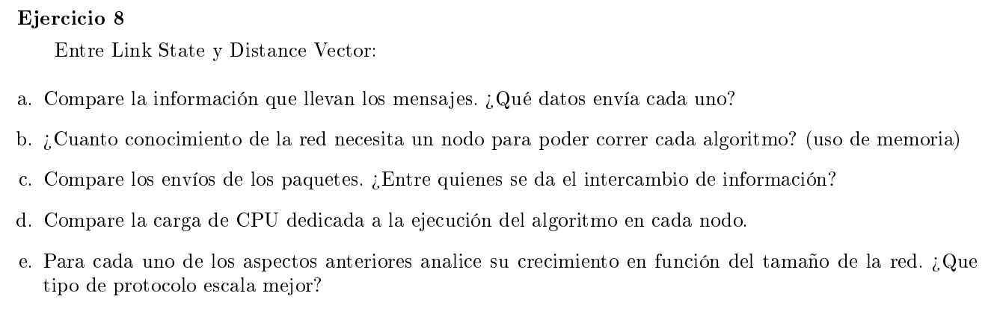

### a

Los mensajes de link state tienen la siguiente estructura:

- ID del nodo que creo el LSP (link-state packet)
- Una lista con los vecinos de dicho nodo con los costos de los links hacia ellos
- Un número de secuencia que sirve para diferenciar en antigüedad a los LSP (si un nodo le llega 2 LSP de otro nodo se queda con el de mayor número de secuencia porque implica que es el que tiene info mas nueva)
- TTL (time to live). Cada nodo que recibe un LSP decrementa el TTL en 1 y lo forwardea para que los demás nodos de la red aprendan dicha info. Para que no quede circulando infinitamente, cuando el TTL llega a 0 el nodo que lo decrementó no lo forwardea.

(En el protocolo OSPF que implementa link-state, cada nodo anuncia la información sobre los links que tiene ya sea que conecta a otras redes como que conecta a otros routers)

Los mensajes de Distance vector tienen la estructura

- Una tabla donde por cada nodo de la red se tiene el costo para llegar a dicho nodo.

(RIP que es un protocolo que implementa distance vector, en vez de guardar el costo para llegar a los distintos routers, guarda el costo para llegar a distintas redes)

### b

Para link-state necesita conocer los LSP de todos los nodos. Es decir la información de los links de todos los nodos.

Para distance vector un nodo necesita saber las tablas de distancias de sus vecinos.

Por lo tanto link-state usa mas memoria por nodo.

### c

En link-state se hace flooding de los paquetes que cada nodo genera. La intención es que todos los paquetes generados por los nodos de la red, llegan a todos los nodos.

En vector distance los intercambios de información se hace entre vecinos.

### d

Sea $V$ son la cantidad de nodos y $E$ la cantidad de aristas del grafo.
El costo del algoritmo de Bellman-Ford es de $O(V \cdot E) = O(V^3)$ y el de Dijkstra es de $O(V^2)$

Por lo tanto el algoritmo de link-state, que es el que utiliza el algoritmo de Dijkstra, tiene menos carga de CPU

### e

