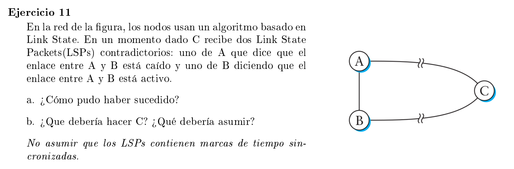

### a

En los algoritmos basados en link-state los nodos generan LSP (link-state packets) por 2 motivos:

- Un time-out: cada cierto intervalo reenvian para avisarle a la red que siguen vivos (en general el periodo de tiempo es largo)
- Un cambio en la topología de la red: un nodo detecta que un vecino suyo está caido y manda un LSP correspondiente.

Podría haber ocurrido que

- el timer de B haya disparado el envio de un LSP mandando a C que el enlace A-B sigue existiendo
- En un instante siguiente se cae el enlace A-B
- Y en un instante posterior a este A envia un LSP a C avisando que el link A-B está caido

### b

Podría asumir que el link está caido y pedir reconfirmación a alguno. El protocolo OSPF define mensajes para hello, request, send y ack. Se podría usar el de request por ejemplo.