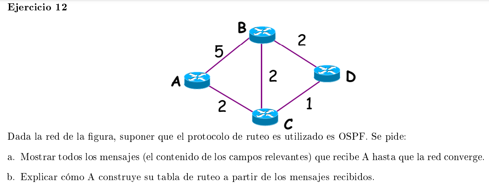

### a

| ID   | B     |   | ID   | C     |   | ID   | D     |
|------|-------|---|------|-------|---|------|-------|
| #SEQ | X     |   | #SEQ | W     |   | #SEQ | Z     |
| TTL  | Y     |   | TTL  | Y     |   | TTL  | Y-1   |
| Nodo | Costo |   | Nodo | Costo |   | Nodo | Costo |
| A    | 5     |   | A    | 2     |   | B    | 2     |
| C    | 2     |   | B    | 2     |   | C    | 1     |
| D    | 1     |   | D    | 1     |   |      |       |

### b

formato: (nodo, distancia, next-hop)

| Confirmado                              | Tentativo           | Descripción                                                                                                                                                                                                           |
|-----------------------------------------|---------------------|-----------------------------------------------------------------------------------------------------------------------------------------------------------------------------------------------------------------------|
| (A, 0, -)                               |                     | Se inicia consigo mismo                                                                                                                                                                                               |
| (A, 0, -)                               | (B, 5, B) (C, 2, C) | Veo los vecinos de A                                                                                                                                                                                                  |
| (A, 0, -) (C, 2, C)                     | (B, 5, B)           | Tomo el de menor costo de tentativos y lo mando a confirmado                                                                                                                                                          |
| (A, 0, -) (C, 2, C)                     | (B, 4, B) (D, 3 ,C) | Pongo en tentativo los vecinos del recien confirmado. Si el vecino ya estaba en tetativos, recalculo si hay alguna distancia que puedo mejorar Si ya estaba en confirmado no lo considero                             |
| (A, 0, -) (C, 2, C) (D, 3, C)           | (B, 4, C)           | Tomo el de menor costo en confirmado y recalculo costos si se pueden mejorar                                                                                                                                          |
| (A, 0, -) (C, 2, C) (D, 3, C) (B, 4, C) |                     | Tomo el de menor costo de tentativos y lo mando a confirmado.                                                                                                                                                         |
| (A, 0, -) (C, 2, C) (D, 3, C) (B, 4, C) |                     | Pongo en tentativo los vecinos del recien confirmado. Si el vecino ya estaba en tetativo recalculo si hay alguna distancia que puedo mejorar Si ya estaba en confirmado no lo considero Como no hay mas nodos terminé |