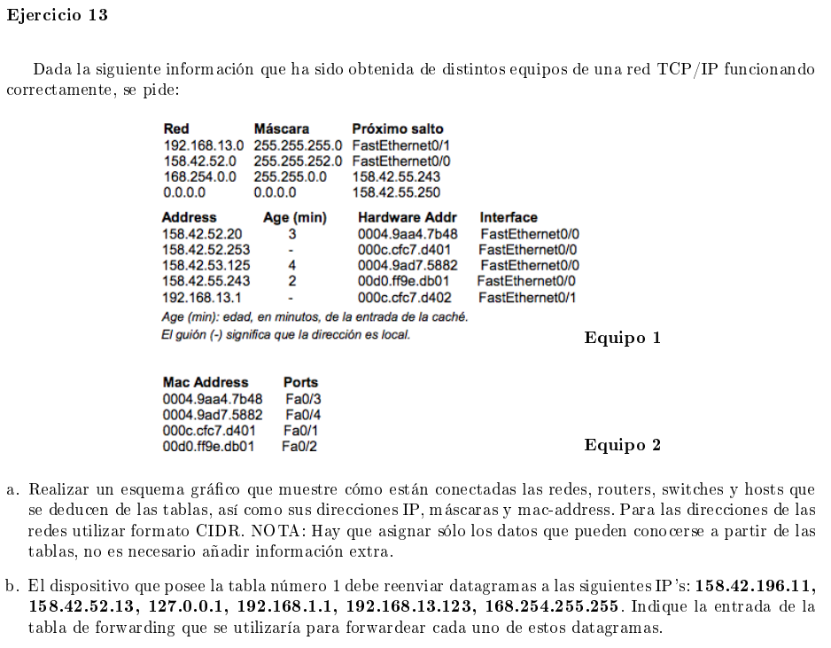
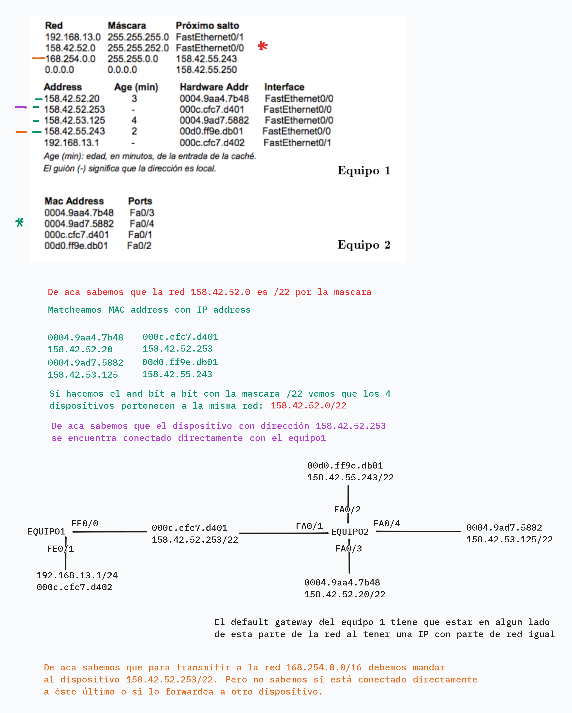

### a

### b

| IP              | Resolución                                            |
|-----------------|-------------------------------------------------------|
| 158.42.196.11   | default gateway                                       |
| 158.42.52.13    | FastEthernet0/0                                       |
| 127.0.0.1       | loop back                                             |
| 192.168.1.1     | default gateway                                       |
| 192.168.13.123  | FastEthernet0/1                                       |
| 168.254.255.255 | FW a 158.42.55.250 que se resuelve a  FastEthernet0/0 |