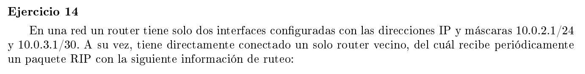
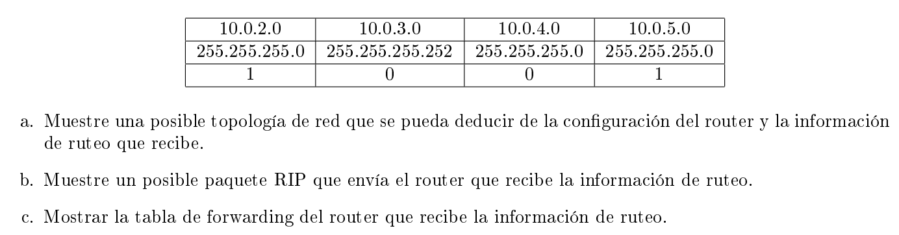
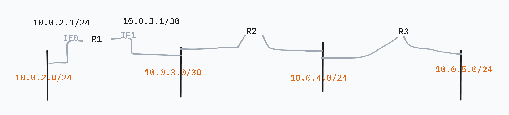

### a

### b

| 10.0.2.0      | 10.0.3.0      | 10.0.4.0      | 10.0.5.0      |
|---------------|---------------|---------------|---------------|
| 255.255.255.0 | 255.255.252.0 | 255.255.255.0 | 255.255.255.0 |
| 0             | 0             | 1             | 2             |

### c

R2 tiene una dirección IP de 10.0.3.2/30 ya que la red 10.0.3.0/30 tiene 4 direcciones de la forma 10.0.3.x con x = 
- 0: identificador de la red
- 1: R1
- 3: broadcast

Por lo que no queda otra que R2 tenga la IP 10.0.3.2/30

| Dirección   | Interface/next hop |
|-------------|--------------------|
| 10.0.2.0/24 | IF0                |
| 10.0.3.0/30 | IF1                |
| 10.0.4.0/24 | 10.0.3.2           |
| 10.0.5.0/24 | 10.0.3.2           |