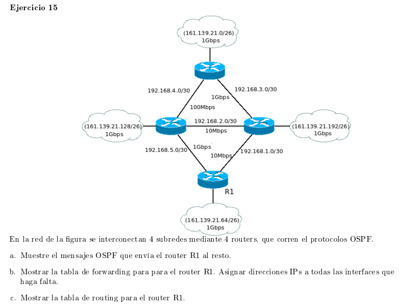
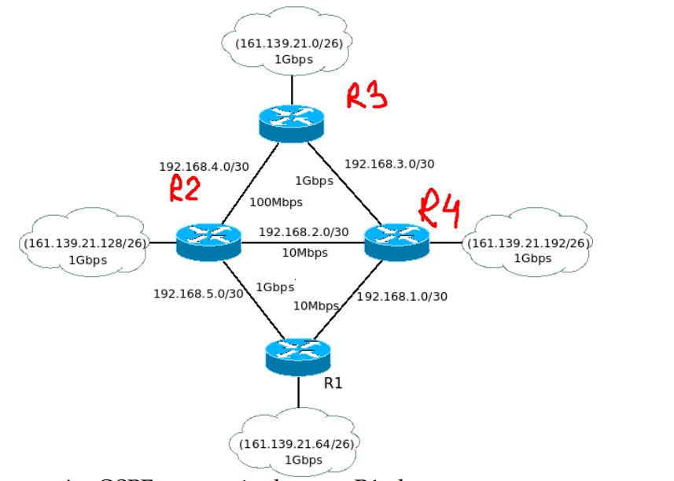

### a

Los mensajes que manda cada nodo en el protocolo OSPF tiene principalmente:
- El id del router que generó el mensaje
- TTL para que no circule infinitamente
- Numero de secuencia para distinguir entre un mensaje viejo y nuevo del mismo router, y así poder tener la información más reciente.
- Una lista de las redes vecinas o routers con los costos de sus links, donde en OSPF la métrica del costo es de $\frac{10^{10}}{\text{Ancho de banda (bps)}}$

| ID               | R1    |
|------------------|-------|
| TTL              | X     |
| #SEQ             | Y     |
| Redes            | Costo |
| 161.139.21.64/26 | 10    |
| 192.168.5.0/30   | 10    |
| 192.168.1.0/30   | 1000  |

### b

| Red               | Interfaz / next hop |
|-------------------|---------------------|
| 161.139.21.64/26  | IF0/0               | 
| 192.168.5.0/30    | IF0/1               | 
| 192.168.1.0/30    | IF0/2               | 
| 192.168.3.0/30    | 192.168.5.1/30      | 
| 192.168.4.0/30    | 192.168.5.1/30      | 
| 161.139.21.128/26 | 192.168.5.1/30      | 
| 161.139.21.0/26   | 192.168.5.1/30      | 
| 161.139.21.192/26 | 192.168.5.1/30      |

Las priemras 3 entradas estan conectadas directamente al router 1, donde el primero corresponde a un link con una red y el segundo y tercero a linkeos con routers.

Las siguientes entradas corresponden a los routers y redes restantes y todos los paquetes se forwardean por 192.168.5.1/30 al tener la ruta menos costosa (detallada en el siguiente punto)

### c

| Red               | Interfaz / next hop | Costo |
|-------------------|---------------------|-------|
| 161.139.21.64/26  | IF0/0               | 0     |
| 192.168.5.0/30    | IF0/1               | 0     |
| 192.168.1.0/30    | IF0/2               | 0     |
| 192.168.3.0/30    | 192.168.5.1/30      | 110   |
| 192.168.4.0/30    | 192.168.5.1/30      | 10    |
| 161.139.21.128/26 | 192.168.5.1/30      | 10    |
| 161.139.21.0/26   | 192.168.5.1/30      | 110   |
| 161.139.21.192/26 | 192.168.5.1/30      | 120   |

Para llegar de la menera menos costosa a:

- 192.168.3.0/30: debemos pasar por el router R2 para luego ir a R3 que está conectado directamente a dicha red (que es un punto a punto con 2 direcciones posibles). Para calcular los costos sumamos los costos de los enlaces de R1 a R2 y R2 a R3
- 192.168.4.0/30: analogamente, la ruta de menor costo es por R2
- Para llegar a las distintas redes 161.139.21.x debemos ir hasta los routers que se conectan a ellos pasando por los caminos menos costosos. En este caso, todos ellos parten con la arista R1-R2. Nuevamente los costos se van calculando sumando los costos de los enlaces que se recorren
