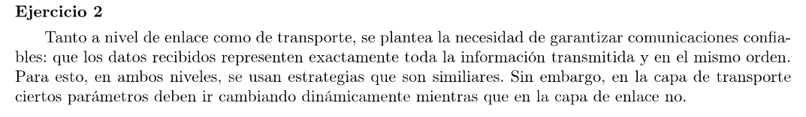
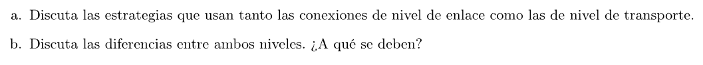
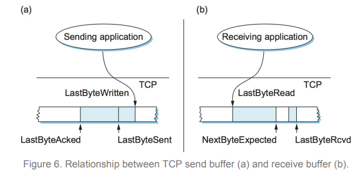

Basicamente los 2 implementan sliding windows para la entrega confiable. En ambos, si un paquete se pierde, se retransmite. Y para eso se usan números de secuencia que identifican a los paquetes.

La diferencia radica en 2 puntos. Primero el de la capa de enlace puede o no tener un buffer para soportar entrega fuera de orden (si se implementa con ACK selectivos entonces sí se soporta). La capa de enlace (implementado en TCP) soporta entrega fuera de orden.

El segundo punto es que la capa de transporte (TCP) implementa mecanismos para control de flujo. Es decir, controlar la cantidad de paquetes que envia el emisor para no colapsar el buffer del receptor. 
En la capa de enlace, cuando al emisor le llega un ACK, transmite el siguiente paquete en el instante.

En la capa de transporte el emisor tiene un buffer que se va llenando con los paquetes que la aplicación emisora genera y se va vaciando a medida que llegan ACKs de mensajes enviados (hasta entonces se guardan en el buffer por si se deben retransmitir). El receptor tiene un buffer que va guardando los paquetes que le llegan y se va vaciando a medida que la aplicación del receptor las va consumiendo. 
El control de flujo es útil cuando el proceso receptor procesa más lento que lo que genera y envia el emisor, eventualmente llenando el buffer del receptor. 

