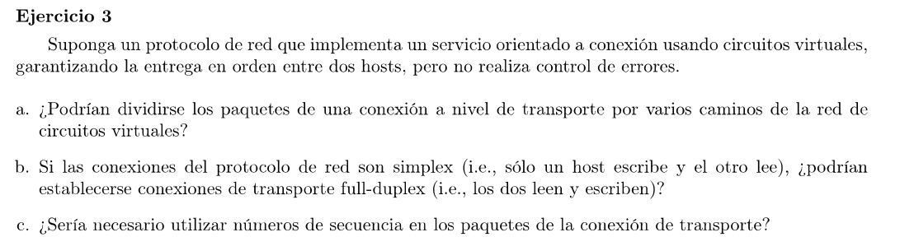

### a

No, el nivel de transporte usa los servicios del nivel de red. Una conexión a nivel de transporte se identifica por IP y puerto. Luego la capa de transporte le indica a la capa de red que envíe los paquetes de la conexión a esa IP (y cuando llega, la capa de transporte del host receptor demultiplexa el paquete con el puerto). Si la capa de red establece un circuito virtual entre ambos hosts entonces los paquetes solo pueden seguir dicho camino en la red.

### b (con dudas)
Si. El protocolo de transporte establece 2 conexiones con puertos distintos, uno para lectura y otro para escritura.

### c
No haría falta ya que la capa de red garantiza la entrega en orden.