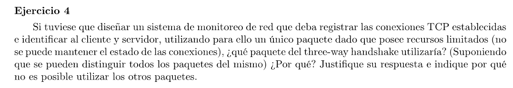
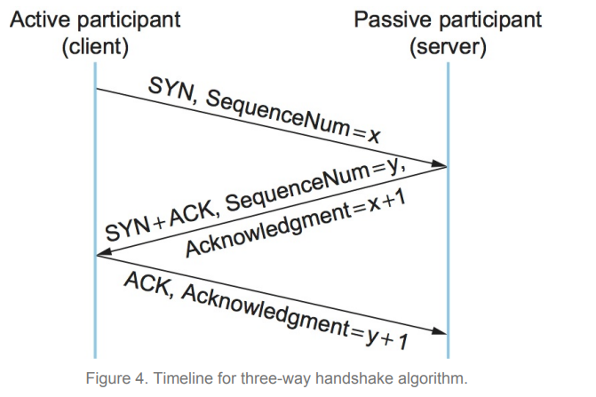

El primer SYN puede no ser procesado por el servidor por lo que no es buen candidato. 
Lo mismo con el segundo paquete, el SYN+ACK puede no ser procesado por el cliente.
El tercer mensaje, el ACK del cliente, es el mejor candidato. Al ver este paquete, ya sabemos que ambos participantes aceptaron establecer la conexión. 
Además, si se pierde en el camino no se retransmite. Ambos ya aceptaron la conexión y estan listos para enviarse mensajes. Por lo que el siguiente paquete del cliente se usará como reemplazo del ACK perdido. Por lo tanto no corremos el riesgo de contar conexiones de más por paquetes duplicados.