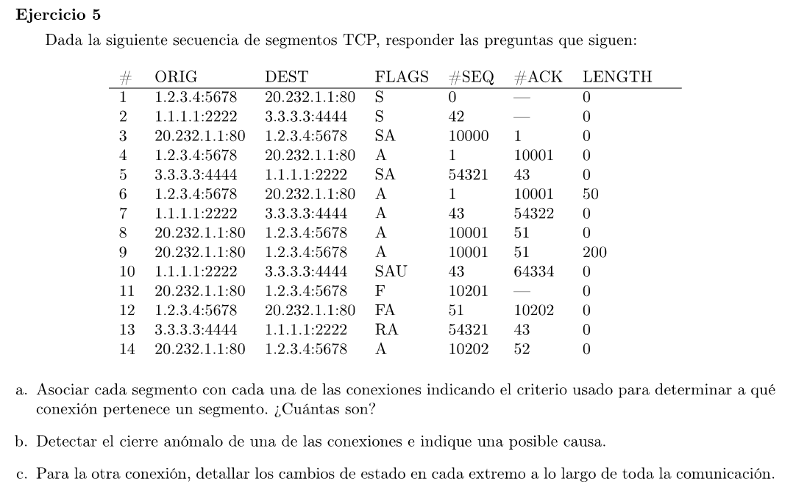

### a y b

Son 2 conexiones:

1.2.3.4:5678 - 20.232.1.1:80
Los paquetes 1, 3, 4 corresponden al 3-way handshake. 
6, 8, 9 intercambio de paqutes.
 11,12,14 cierre de la conexión

1.1.1.1:2222 - 3.3.3.3:4444
2, 5, 7 3-way handshake
10 paquete con el flag de SYN y URG prendido. Como la conexión ya estaba establecida, el SYN causará un cierra anomalo.
13 se cierra la conexión ya que el flag Reset se encuentra encendido

### c

El host 1.2.3.4 (host A) realiza una apertura activa. El host A pasa de CLOSED a SYN_SENT

El host 20.232.1.1 (host B) responde con un SYN + ACK por lo que pasa del estado LISTEN a SYN_RCVD

Host A recibe este mensaje, manda un ACK y pasa a ESTABLISHED

Host B lo recibe y tambien pasa a ESTABLISHED

Se intercambian mensajes por un rato y luego inician el protocolo para el cierre de la conexión

Host B envia un mensaje con el flag FIN. Pasa al estado FIN_WAIT_1

Host A lo recibe y pasa a CLOSE_WAIT y envia un mensaje con ACK + FIN. El host entonces acepta el cierre del host B y decide finalizar su conexión. El host A pasa al estado LAST_ACK

El host B recibe el ACK + FIN y pasa al estado TIME_WAIT y envía un ACK al host A.

Finalmente ambas partes pasan al estado CLOSED. El host A cuando recibe el ACK, y el host B luego de esperar un tiempo.

Este tiempo de espera corresponde al doble del tiempo que está configurado en la red que puede vivir un paquete en circulación. Así si quedan paquetes circulando, no afectan a la siguiente encarnación (nueva conexión con mismas IPs y puertos). Además si el último ACK se pierde y el host B pasa al estado CLOSED, no puede reenviar el ACK y el host A queda en un estado inválido.