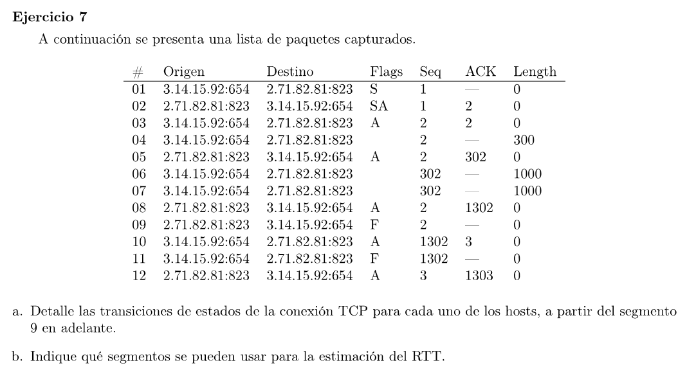

### a

1 al 3 corresponde al 3-way handshake

4 al 8 transmisión de datos

9 a 12 cierra de la conexión

Antes del paquete 9 ambos hosts se encuentran en el estado ESTABLISHED.

Host A: 3.14.15.92:654
Host B: 2.71.82.81:823 

En el paquete 9, el host B envía un FIN por lo que pasa al estado FIN_WAIT_1

En el 10, el host A lo recibe, pasa al estado CLOSE_WAIT y envía el ACK. El host B al recibirlo pasa al estado FIN_WAIT_2

El host A a continuación cierra la conexión mandando en el paquete 11 un FIN y pasa al estado LAST_ACK.

El host B lo recibe y envía en el paquete 12 el ACK y pasa al estado TIME_WAIT

Finalmente el host A recibe el último ACK y pasa a CLOSED. El host B luego de esperar un tiempo transiciona a CLOSED

### b

Para estimar el RTT se debe calcular el tiempo entre la salida del paquete y la llegada del ACK.

Los mejores segmentos son aquellos que tienen bytes de información (length > 0) y no hayan sido retransmitidos. Si se usara un segmento con length = 0 no habría forma de distinguir si el próximo ACK que llega fue enviado para dicho segmento o no.
En TCP si el segmento no tiene datos (se usa solo para marcar algún flag) el número de secuencia no se incrementa. Luego podría llegar un ACK de un segmento anterior al nuestro (el de length 0) y no correspondería a dicho segmento, pero puede ACKearlo al no haber incrementado el número de secuencia (por tener length = 0). De esta forma se tendría un calculo errado del RTT.
Con un segmento de length > 0, los ACKs viejos no servirían para marcarlos como reconocidos.

En la tabla se podría usar el segmento 4 que envía 300 bytes y el segmento 5 correspondiente al ACK de todos esos bytes.