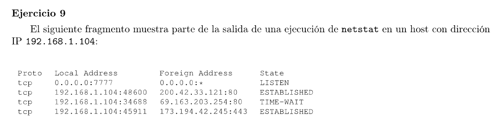
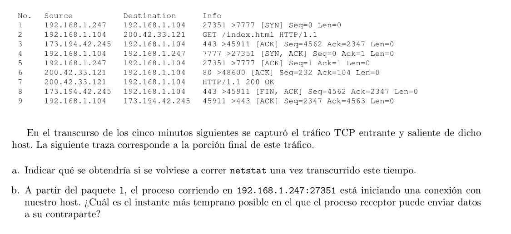

### a

192.168.1.104:7777 - 192.168.1.247:27351 ESTABLISHED

192.168.1.104:8600 - 200.42.33.121:80 ESTABLISHED

192.168.1.104:45911 - 173.194.42.245:433 CLOSE_WAIT

### b

Siendo el proceso receptor 192.168.1.104:7777, él manda en el paquete 4 el SYN+ACK del 3-way handshake. Tiene que esperar a que el otro host le llegue antes de poder enviar datos. Ya que se podría perder y habría que retransmitirlo. Una vez recibido el ACK de la contraparte, se está seguro que ambos están dispuestos a empezar a recibir datos. Por lo que a partir de la llegada del paquete 5 (el ACK del SYN+ACK) se podría empezar a enviar datos.