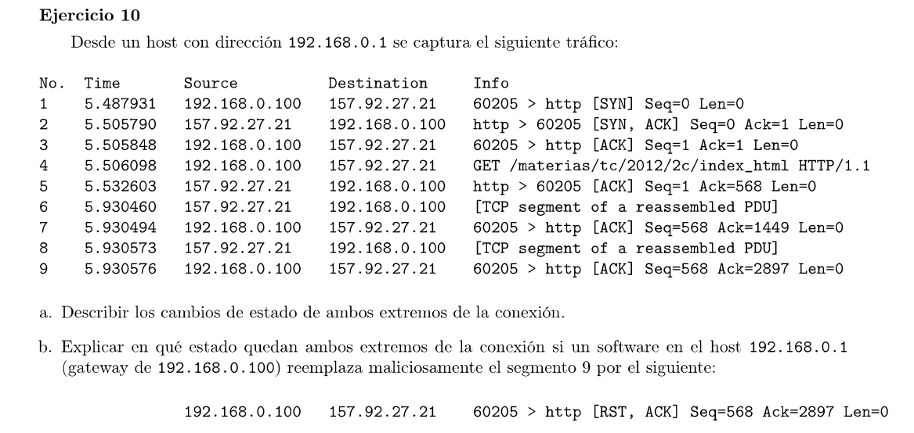

### a

Los paquetes 1 a 3 corresponden al establecimiento de la conexión con el protocolo 3-way handshake

Host A: 192.168.0.100:60205
Host B: 157.92.27.21:http (puerto 80)

El host A pasa de SYN_SENT a ESTABLISHED
El host B pasa de LISTEN a SYN_RCVD a ESTABLISHED

De los mensajes 4 a 9 se intercambian datos por lo que ambos se mantienen en ESTABLISHED

### b

El host A no se entera de esto y queda en el estado ESTABLISHED, y el host B al recibir un mensaje con flag RST cierra la conexión de forma abrupta.

Este flag se usa para comunicar que algo salió mal y el host que la recibe cierra inmediantamente la conexión.