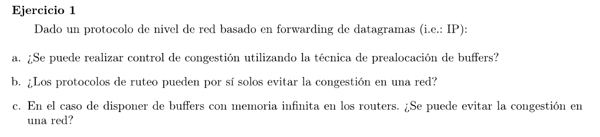

### a

Se podría hacer si se sabe que la cantidad de clientes es acotada, dandole a cada uno una porción de buffer. En general no lo es, por lo que se podría decir que este mecanismo de control de congestión no escala.

### b

Los protoclos de ruteo se encargan de encontrar caminos que conecten los hosts en la red. Puede haber algún algoritmo que use como costo el nivel de congestión de la red para armar los caminos, por lo que puede ayudar a mitigar cierta congestión pero no evitarla.
Hasta podría haber protocolos de enrutamiento que manden mensajes periódicos informando el nivel de congestión de sus enlaces para que los routers modifiquen el tráfico de ciertas rutas. Puede tener cierta complejidad adicional (capaz todos los routers deciden cambiar a un enlace que no estaba saturado y ahora pasa a estarlo).

### c

No. El problema radica en las distintas velocidades de los enlaces y de procesamiento de los distintos routers. Un router puede guardar la cantidad de paquetes que quiera, pero si le llegan más de los que puede ir liberando (por ejemplo el enlace de "salida" tiene una velocidad menor que el conjunto de "entrada") entonces se percibirá un aumento en el delay: congestión. 
Además se comenzaría a agravar la congestión ya que ocurrirían timeouts provocando, retransmisiones, llenando más los buffers y ésto volvería a ocasionar más timeouts.