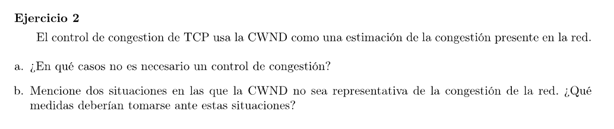

### a

Para redes en las que los routers reserven recursos para las conexiones, por ejemplo circuitos virtuales o redes privadas. Otro caso son redes con capacidades altas y poco tráfico.

### b

El algoritmo de control de congestión de TCP se basa en interpretar timeouts como pérdida de paquetes por congestión. Pero la pérdida podría deberse a otro motivo (por ejemplo ruido en el canal físico: interferencias en una red inalámbrica), y el algoritmo lo interpretará cómo una congestión en la red, reduciendo de forma erronea la Congestion Window.