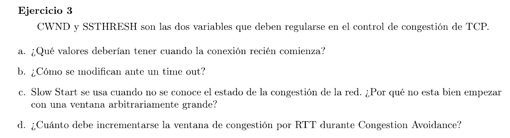

### a

El SSTHRESH marca el límite en el que se debe dejar de usar Slow Start para pasar a Congestion Avoidance (o Additive Increase). 
Slow Start en cada RTT duplica el CWND (incrementa en 1 por cada byte que reconoce el ACK) con el objetivo de alcanzar la capacidad de la red lo más rápido posible obteniendo mejores throughputs.

Por lo tanto podemos setear el SSTHRESH en algún valor alto (64 kb dice la guía práctica). Y la CWND podemos setearla en 2 SMSS.

El SMSS (Sender Maximum Sender Size) se calcula teniendo en cuanta el MTU de la conexión y el tamaño de los headers TCP e IP. (La cátedra lo setea a 2KB).

### b

Cuando ocurre un timeout, el CWND toma el mínimo valor posible (igual a un SMSS).
SSTHRESH $=max(fligthsize/2, 2 \times SMSS)$
flightsize: la cantidad de bytes que estaban siendo transmitidas y todavía no fueron reconocidas (bytes enviados - bytes reconocidos).

Cuando flightsize = CWND entonces se está aprovechando el emisor está usando todo el ancho de banda disponible. Cuando FS < CWND, el emisor tiene espacio para mandar más paquetes. Si hay congestión TCP reduce el CWND, limitando consecuentemente el FS.

### c

Se lo llama slow start por que la alternativa de TCP en su momento era mandar el advertised window completo al iniciar la conexión. La red podría tener ancho de banda disponible para soportar el burst pero capaz no habría espacio suficiente en los buffers, causando congestión.

### d

El objetivo de Congestion Avoidance es incrementar el CWND de tal forma de evitar la congestión. La fórmula es
$CWND += SMSS^2/CWND$ por cada ACK que llegue, o en consecuencia se incrementa el CWND en 1 (SMSS) por cada RTT.