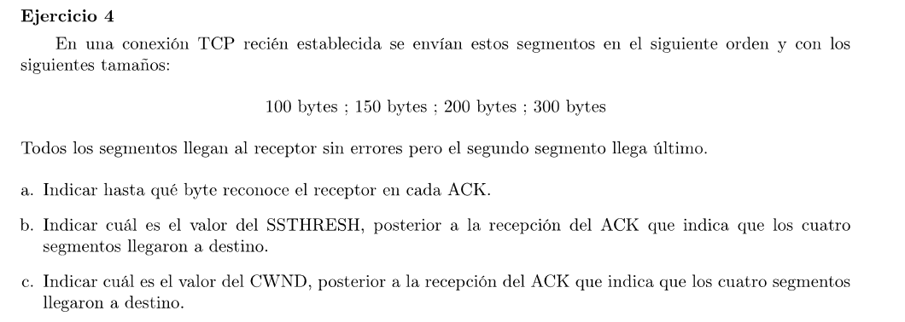
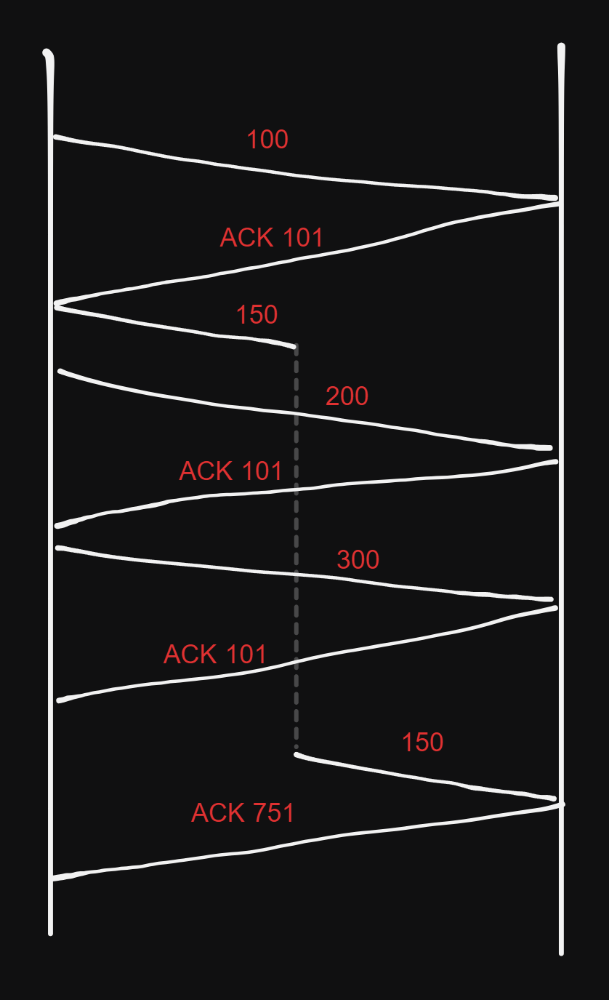

### a

### b
Como no hubo pérdidas (el enunciado aclara que llegan todos sin errores) entonces no hay timeouts y por lo tanto no se modifica el valor del SSTHRESH (Mantiene el inicial).

### c

El CWND inicial es de 2 SMSS = 2 * 2KB = 4KB.

Por cada ACK, al estar en Slow Start por CWND < SSTHRESH, sumams al CWND min(N, SMSS) donde N es la cantidad de bytes reconocidos por el ACK.

Como al final se reconocen todos los bytes enviados, el CWND = 4.75KB