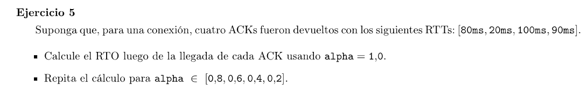
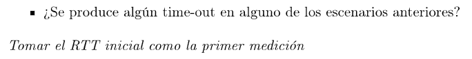

RTT[1] = 80 ms 
RTO = 160 ms

RTT[2] = 20 ms 
RTO = 40 ms

RTT[3] = 100 ms 
RTO = 100 ms

RTT[4] = 90 ms 
RTO = 180 ms

Con $\alpha = 0.8$

RTT[1] = $0.8 \cdot 80ms + 0.2 \cdot 80ms = 80ms$
RTO = 160 ms

RTT[2] = $0.8 \cdot 80ms + 0.2 \cdot 20ms = 68ms$ 
RTO = 136 ms

RTT[3] = $0.8 \cdot 68ms + 0.2 \cdot 100ms = 74.4ms$ 
RTO = 148.8 ms

RTT[4] = $0.8 \cdot 74.4ms + 0.2 \cdot 90ms = 77.52ms$
RTO = 155.04 ms