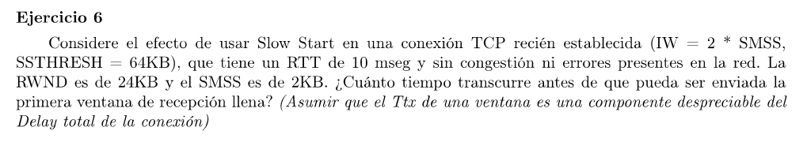

| RTT | CWND | SSTHRESH | FLIGHTSIZE = MIN (CWND, RWND=24KB) |
|-----|------|----------|------------------------------------|
| 1   | 4KB  | 64KB     | 4KB                                |
| 2   | 8KB  | 64KB     | 8KB                                |
| 3   | 16KB | 64KB     | 16KB                               |
| 4   | 32KB | 64KB     | 24KB                               |

En el 4 RTT ya se envía una RWND completa. Es decir que pasan 30mseg