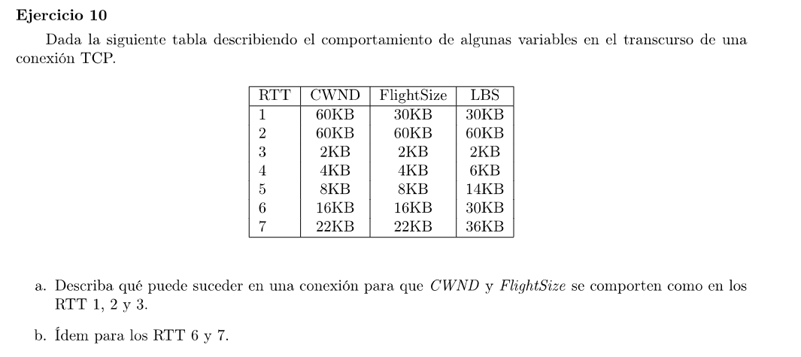

### a

En el RTT 1 se envian 30KB sin llenar por completo el Congestion Window. En el segundo RTT se envían otros 30 KB y todavía no llegaron los ACK de los primero 30, por lo que el flightsize es de 60KB.

En el RTT 3 se pone la CWND = SMSS = 2KB que seguro fue a causa de un time out. El valor de LBS = 2kb por lo que los timers de los 60KB caducaron.

### b

En el RTT 6 se envían 16KB de los cuales solo llega el ACK para 6KB. Entonces para el RTT 7 el CWND = 16 + 6 = 22.

Creo que está mal el enunciado y el FS en el RTT 7 tiene que ser 16.

FS = LSB - LB-ACK (Last Byte Sent - Last Byte Acknowledged)

En este caso del RTT 6 al 7 LBS pasa de 30 a 36, por lo que se envió 6KB más de datos. Además se incrementó el CWND por 6 (siguiendo el slow start 1 por cada byte reconocido). Por lo que LB-ACK = 20 (En el RTT 5 era 14 y en el RTT 6 se vé que todos fueron reconocidos porque se vuelve a duplicar el CWND. Entonces LBAck = 14 + 6 de ahora). 
Luego FS = 36 - 20 = 16