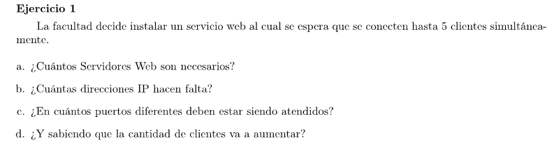

### a

1

### b

1

### c

1

### d

Lo mismo para todo

Es una decisión de implementación el cómo distinguir a los clientes. Por ejemplo se podría tener una conexión TCP/IP distinta por cada cliente. El servidor escucha peticiones por el mismo puerto. Los clientes, si se conectan desde distintos hosts, se pueden diferenciar por la IP y si lo hacen por el mismo host, se pueden diferenciar cada uno usando un puerto distinto.

También está la opción que se implemente la funcionalidad de que el cliente abra distintas sesiones de la aplicación en un mismo host y que todas usen la misma conexión TCP/IP. En este caso, la capa de aplicación tiene que implementar un mecanismo para diferenciar cada una de las sesiones.

Pero todas estas medidas no afectan a que el servidor tiene una única IP y puede configurarse para escuchar en un único puerto sin importar la cantidad de clientes.